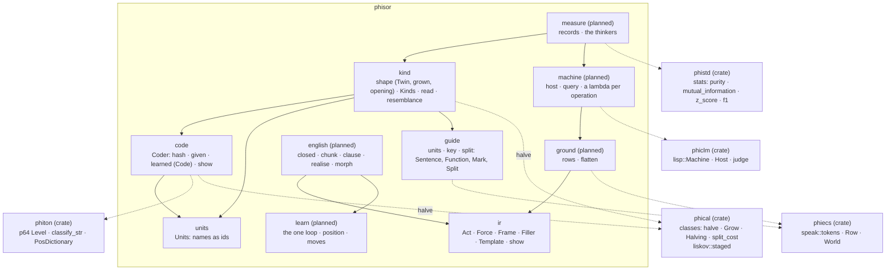
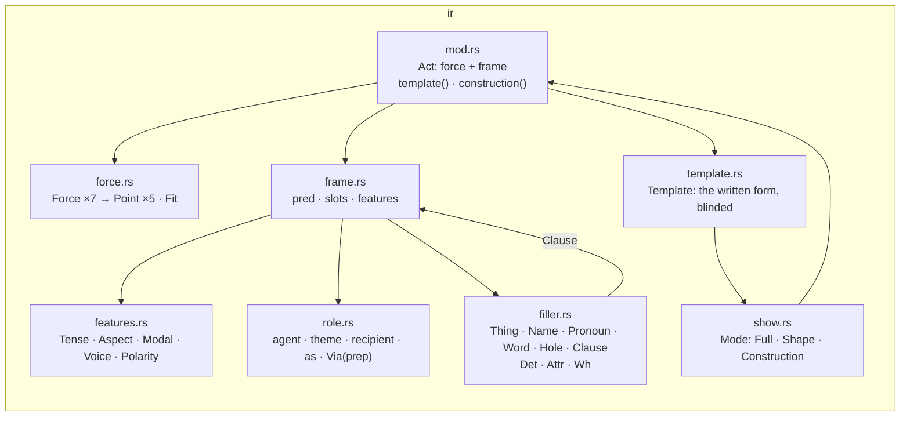
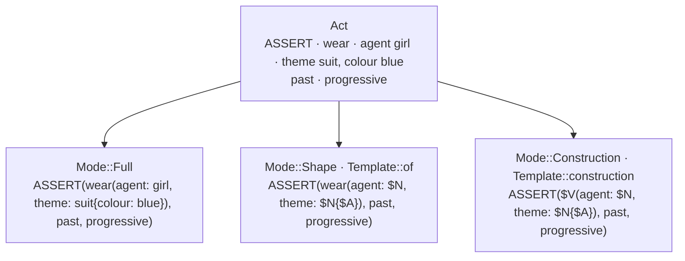

# phisor — architecture

## The modules, built and planned

```mermaid
graph TB
    subgraph crate["phisor"]
        ir["ir<br/>Act · Force · Frame · Filler · Template · show"]
        guide["guide<br/>units · key · split: Sentence, Function, Mark, Split"]
        code["code<br/>Coder: hash · given · learned (Code) · show"]
        kind["kind<br/>shape (Twin, grown, opening) · Kinds · read · resemblance"]
        units["units<br/>Units: names as ids"]
        english["english (planned)<br/>closed · chunk · clause · realise · morph"]
        learn["learn (planned)<br/>the one loop · position · moves"]
        ground["ground (planned)<br/>rows · flatten"]
        machine["machine (planned)<br/>host · query · a lambda per operation"]
        measure["measure (planned)<br/>records · the thinkers"]
    end
    code --> units
    kind --> code
    kind --> units
    kind --> guide
    english --> ir
    english --> learn
    ground --> ir
    machine --> ground
    measure --> kind
    measure --> machine
    X_phiton["phiton (crate)<br/>p64 Level · classify_str · PosDictionary"]
    X_phical["phical (crate)<br/>classes: halve · Grow · Halving · split_cost<br/>liskov::staged"]
    X_phistd["phistd (crate)<br/>stats: purity · mutual_information · z_score · f1"]
    X_phiecs["phiecs (crate)<br/>speak::tokens · Row · World"]
    X_phiclm["phiclm (crate)<br/>lisp::Machine · Host · judge"]
    code -.-> X_phiton
    code -.->|"halve"| X_phical
    kind -.->|"halve"| X_phical
    guide -.-> X_phiecs
    ground -.-> X_phiecs
    machine -.-> X_phiclm
    measure -.-> X_phistd
```

## ir: the files

```mermaid
graph LR
    subgraph ir_["ir"]
        modrs["mod.rs<br/>Act: force + frame<br/>template() · construction()"]
        force["force.rs<br/>Force ×7 → Point ×5 · Fit"]
        features["features.rs<br/>Tense · Aspect · Modal · Voice · Polarity"]
        role["role.rs<br/>agent · theme · recipient · as · Via(prep)"]
        filler["filler.rs<br/>Thing · Name · Pronoun · Word · Hole · Clause<br/>Det · Attr · Wh"]
        frame["frame.rs<br/>pred · slots · features"]
        template["template.rs<br/>Template: the written form, blinded"]
        show["show.rs<br/>Mode: Full · Shape · Construction"]
    end
    modrs --> force
    modrs --> frame
    frame --> features
    frame --> role
    frame --> filler
    filler -->|"Clause"| frame
    template --> show
    show --> modrs
    modrs --> template
```

## An act, written three ways

```mermaid
graph TB
    act["Act<br/>ASSERT · wear · agent girl · theme suit, colour blue<br/>past · progressive"]
    full["Mode::Full<br/>ASSERT(wear(agent: girl, theme: suit{colour: blue}), past, progressive)"]
    shape["Mode::Shape · Template::of<br/>ASSERT(wear(agent: $N, theme: $N{$A}), past, progressive)"]
    cons["Mode::Construction · Template::construction<br/>ASSERT($V(agent: $N, theme: $N{$A}), past, progressive)"]
    act --> full
    act --> shape
    act --> cons
```
