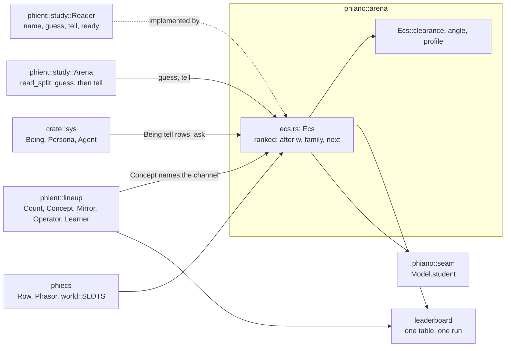

# arena

```mermaid
graph LR
    Study["phient::study::Arena<br/>read_split: guess, then tell"]
    ReaderT["phient::study::Reader<br/>name, guess, tell, ready"]
    Lineup["phient::lineup<br/>Count, Concept, Mirror, Operator, Learner"]
    Sys["crate::sys<br/>Being, Persona, Agent"]
    Phiecs["phiecs<br/>Row, Phasor, world::SLOTS"]

    subgraph arena["phiano::arena"]
        Ecs["ecs.rs: Ecs<br/>ranked: after w, family, next"]
        Clear["Ecs::clearance, angle, profile"]
    end

    Board["leaderboard<br/>one table, one run"]
    Seam["phiano::seam<br/>Model.student"]

    ReaderT -.->|"implemented by"| Ecs
    Study -->|"guess, tell"| Ecs
    Lineup -->|"Concept names the channel"| Ecs
    Sys -->|"Being.tell rows, ask"| Ecs
    Phiecs --> Ecs
    Ecs --> Clear
    Ecs --> Board
    Lineup --> Board
    Ecs --> Seam
```
