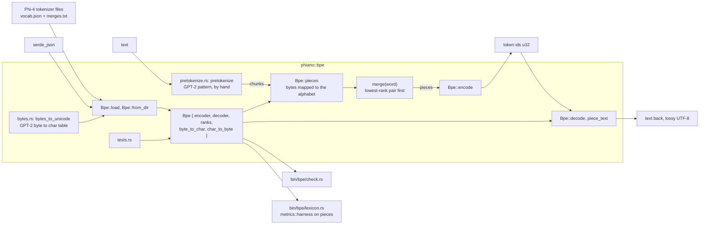

# bpe

```mermaid
graph LR
    Files["Phi-4 tokenizer files<br/>vocab.json + merges.txt"]
    Json["serde_json"]
    Text["text"]

    subgraph bpe["phiano::bpe"]
        Load["Bpe::load, Bpe::from_dir"]
        Bytes["bytes.rs: bytes_to_unicode<br/>GPT-2 byte to char table"]
        Bpe["Bpe { encoder, decoder, ranks,<br/>byte_to_char, char_to_byte }"]
        Pre["pretokenize.rs: pretokenize<br/>GPT-2 pattern, by hand"]
        Pieces["Bpe::pieces<br/>bytes mapped to the alphabet"]
        Merge["merge(word)<br/>lowest-rank pair first"]
        Encode["Bpe::encode"]
        Decode["Bpe::decode, piece_text"]
        Tests["tests.rs"]
    end

    Ids["token ids u32"]
    Back["text back, lossy UTF-8"]
    Check["bin/bpe/check.rs"]
    Lexicon["bin/bpe/lexicon.rs<br/>metrics::harness on pieces"]

    Files --> Load
    Json --> Load
    Bytes --> Load
    Load --> Bpe
    Text --> Pre
    Pre -->|"chunks"| Pieces
    Bpe --> Pieces
    Pieces --> Merge
    Merge -->|"pieces"| Encode
    Encode --> Ids
    Ids --> Decode
    Bpe --> Decode
    Decode --> Back
    Bpe --> Check
    Bpe --> Lexicon
    Tests --> Bpe
```
