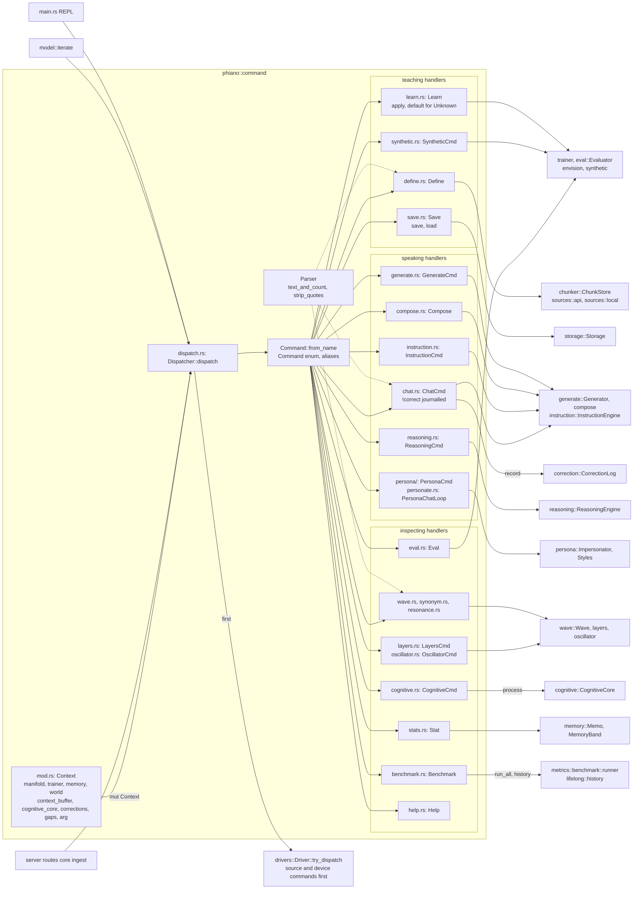

# command

```mermaid
graph LR
    Main["main.rs REPL"]
    Iterate["model::iterate"]
    Ingest["server routes core ingest"]
    Drivers["drivers::Driver::try_dispatch<br/>source and device commands first"]

    subgraph command["phiano::command"]
        Ctx["mod.rs: Context<br/>manifold, trainer, memory, world<br/>context_buffer, cognitive_core, corrections, gaps, arg"]
        Dispatch["dispatch.rs: Dispatcher::dispatch"]
        FromName["Command::from_name<br/>Command enum, aliases"]
        Parser["Parser<br/>text_and_count, strip_quotes"]
        subgraph teach["teaching handlers"]
            Learn["learn.rs: Learn<br/>apply, default for Unknown"]
            Define["define.rs: Define"]
            Synthetic["synthetic.rs: SyntheticCmd"]
            Save["save.rs: Save<br/>save, load"]
        end
        subgraph speak["speaking handlers"]
            Generate["generate.rs: GenerateCmd"]
            Compose["compose.rs: Compose"]
            Instruct["instruction.rs: InstructionCmd"]
            Chat["chat.rs: ChatCmd<br/>!correct journalled"]
            Reason["reasoning.rs: ReasoningCmd"]
            Persona["persona/: PersonaCmd<br/>personate.rs: PersonaChatLoop"]
        end
        subgraph inspect["inspecting handlers"]
            Eval["eval.rs: Eval"]
            WaveCmds["wave.rs, synonym.rs, resonance.rs"]
            Field["layers.rs: LayersCmd<br/>oscillator.rs: OscillatorCmd"]
            Cog["cognitive.rs: CognitiveCmd"]
            Stat["stats.rs: Stat"]
            Bench["benchmark.rs: Benchmark"]
            Help["help.rs: Help"]
        end
    end

    Teach["trainer, eval::Evaluator<br/>envision, synthetic"]
    Sources["chunker::ChunkStore<br/>sources::api, sources::local"]
    Storage["storage::Storage"]
    Gen["generate::Generator, compose<br/>instruction::InstructionEngine"]
    Reasoning["reasoning::ReasoningEngine"]
    PersonaM["persona::Impersonator, Styles"]
    WaveM["wave::Wave, layers, oscillator"]
    CogM["cognitive::CognitiveCore"]
    Memory["memory::Memo, MemoryBand"]
    Metrics["metrics::benchmark::runner<br/>lifelong::history"]
    Corrections["correction::CorrectionLog"]

    Main --> Dispatch
    Iterate --> Dispatch
    Ingest --> Dispatch
    Ctx -->|"mut Context"| Dispatch
    Dispatch -->|"first"| Drivers
    Dispatch --> FromName
    Parser -.-> Define
    Parser -.-> Chat
    Parser -.-> WaveCmds
    FromName --> Learn
    FromName --> Define
    FromName --> Synthetic
    FromName --> Save
    FromName --> Generate
    FromName --> Compose
    FromName --> Instruct
    FromName --> Chat
    FromName --> Reason
    FromName --> Persona
    FromName --> Eval
    FromName --> WaveCmds
    FromName --> Field
    FromName --> Cog
    FromName --> Stat
    FromName --> Bench
    FromName --> Help
    Learn --> Teach
    Synthetic --> Teach
    Eval --> Teach
    Define --> Sources
    Save --> Storage
    Generate --> Gen
    Compose --> Gen
    Instruct --> Gen
    Chat --> Gen
    Chat -->|"record"| Corrections
    Reason --> Reasoning
    Persona --> PersonaM
    WaveCmds --> WaveM
    Field --> WaveM
    Cog -->|"process"| CogM
    Stat --> Memory
    Bench -->|"run_all, history"| Metrics
```
