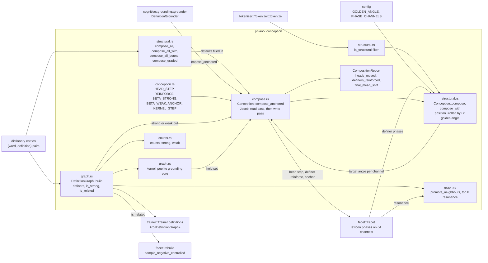

# conception

```mermaid
graph LR
    Entries["dictionary entries<br/>(word, definition) pairs"]
    Grounder["cognitive::grounding::grounder<br/>DefinitionGrounder"]
    Tok["tokenizer::Tokenizer::tokenize"]
    Config["config<br/>GOLDEN_ANGLE, PHASE_CHANNELS"]
    FacetN["facet::Facet<br/>lexicon phases on 64 channels"]
    TrainerN["trainer::Trainer.definitions<br/>Arc&lt;DefinitionGraph&gt;"]
    Negatives["facet::rebuild<br/>sample_negative_controlled"]

    subgraph conception["phiano::conception"]
        Consts["conception.rs<br/>HEAD_STEP, REINFORCE, BETA_STRONG,<br/>BETA_WEAK, ANCHOR, KERNEL_STEP"]
        Structural["structural.rs<br/>is_structural filter"]
        ComposeFn["structural.rs<br/>Conception::compose, compose_with<br/>position i rolled by i x golden angle"]
        Chain["structural.rs<br/>compose_all, compose_all_with,<br/>compose_all_bound, compose_graded"]
        Anchored["compose.rs<br/>Conception::compose_anchored<br/>Jacobi read pass, then write pass"]
        Graph["graph.rs<br/>DefinitionGraph::build<br/>definers, is_strong, is_related"]
        Promote["graph.rs<br/>promote_neighbours, top k resonance"]
        Kernel["graph.rs<br/>kernel, peel to grounding core"]
        Counts["counts.rs<br/>counts: strong, weak"]
        Report["CompositionReport<br/>heads_moved, definers_reinforced,<br/>final_mean_shift"]
    end

    Entries --> Graph
    Entries --> Chain
    Graph --> Promote
    FacetN -->|"resonance"| Promote
    Graph --> Kernel
    Graph --> Counts
    Chain -->|"defaults filled in"| Anchored
    Grounder -->|"compose_anchored"| Anchored
    Consts --> Anchored
    Graph -->|"strong or weak pull"| Anchored
    Kernel -->|"hold set"| Anchored
    Tok --> Structural
    Structural --> ComposeFn
    Config --> ComposeFn
    FacetN -->|"definer phases"| ComposeFn
    Anchored --> ComposeFn
    ComposeFn -->|"target angle per channel"| Anchored
    Anchored -->|"head step, definer reinforce, anchor"| FacetN
    Anchored --> Report
    Graph --> TrainerN
    Graph -->|"is_related"| Negatives
```
