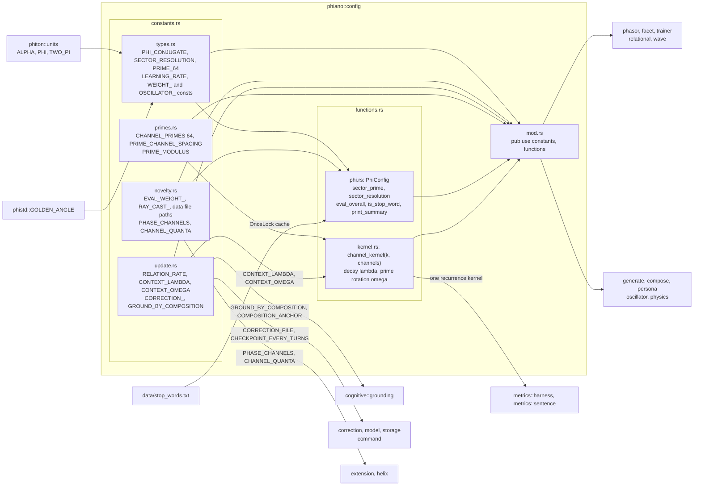

# config

```mermaid
graph LR
    Units["phiton::units<br/>ALPHA, PHI, TWO_PI"]
    Golden["phistd::GOLDEN_ANGLE"]
    Stop["data/stop_words.txt"]

    subgraph config["phiano::config"]
        ModRs["mod.rs<br/>pub use constants, functions"]
        subgraph constants["constants.rs"]
            Types["types.rs<br/>PHI_CONJUGATE, SECTOR_RESOLUTION, PRIME_64<br/>LEARNING_RATE, WEIGHT_ and OSCILLATOR_ consts"]
            Novelty["novelty.rs<br/>EVAL_WEIGHT_, RAY_CAST_, data file paths<br/>PHASE_CHANNELS, CHANNEL_QUANTA"]
            Update["update.rs<br/>RELATION_RATE, CONTEXT_LAMBDA, CONTEXT_OMEGA<br/>CORRECTION_, GROUND_BY_COMPOSITION"]
            Primes["primes.rs<br/>CHANNEL_PRIMES 64, PRIME_CHANNEL_SPACING<br/>PRIME_MODULUS"]
        end
        subgraph functions["functions.rs"]
            PhiConfig["phi.rs: PhiConfig<br/>sector_prime, sector_resolution<br/>eval_overall, is_stop_word, print_summary"]
            Kernel["kernel.rs: channel_kernel(k, channels)<br/>decay lambda, prime rotation omega"]
        end
    end

    Core["phasor, facet, trainer<br/>relational, wave"]
    Metrics["metrics::harness, metrics::sentence"]
    Ground["cognitive::grounding"]
    Persist["correction, model, storage<br/>command"]
    Ext["extension, helix"]
    Speak["generate, compose, persona<br/>oscillator, physics"]

    Units --> Types
    Golden --> Types
    Types --> PhiConfig
    Novelty --> PhiConfig
    Stop -->|"OnceLock cache"| PhiConfig
    Primes --> Kernel
    Update -->|"CONTEXT_LAMBDA, CONTEXT_OMEGA"| Kernel
    Types --> ModRs
    Novelty --> ModRs
    Update --> ModRs
    Primes --> ModRs
    PhiConfig --> ModRs
    Kernel --> ModRs
    ModRs --> Core
    ModRs --> Speak
    Kernel -->|"one recurrence kernel"| Metrics
    Update -->|"GROUND_BY_COMPOSITION, COMPOSITION_ANCHOR"| Ground
    Update -->|"CORRECTION_FILE, CHECKPOINT_EVERY_TURNS"| Persist
    Novelty -->|"PHASE_CHANNELS, CHANNEL_QUANTA"| Ext
```
