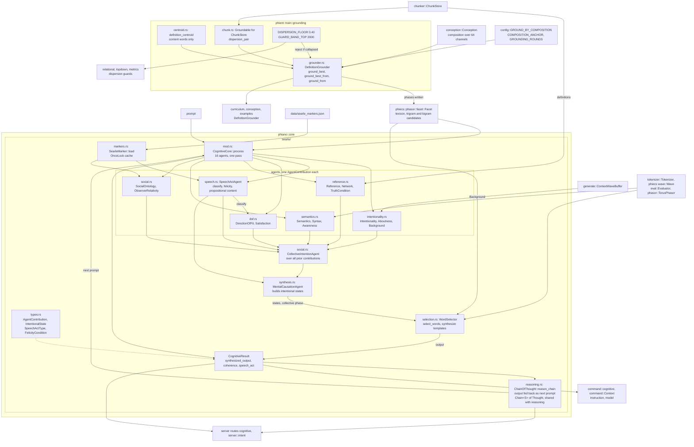

# core

`phiano::core`: `searle` (it was `cognitive`). The grounding beside it is `phient::train::grounding` now, drawn here outside the box.

```mermaid
graph TB
    Prompt["prompt"]
    Facet["phiecs::phasor::facet::Facet<br/>lexicon, trigram and bigram candidates"]
    Buffer["generate::ContextWaveBuffer"]
    Chunks["chunker::ChunkStore"]
    MarkersJson["data/searle_markers.json"]
    Helpers["tokenizer::Tokenizer, phiecs wave::Wave<br/>eval::Evaluator, phasor::TorusPhasor"]
    Conception["conception::Conception<br/>composition over 64 channels"]
    Config["config::GROUND_BY_COMPOSITION<br/>COMPOSITION_ANCHOR, GROUNDING_ROUNDS"]

    subgraph core["phiano::core"]
      subgraph searle["searle/"]
        Core["mod.rs: CognitiveCore::process<br/>16 agents, one pass"]
        Types["types.rs<br/>AgentContribution, IntentionalState<br/>SpeechActType, FelicityCondition"]
        Markers["markers.rs: SearleMarker::load<br/>OnceLock cache"]
        subgraph agents["agents, one AgentContribution each"]
            Intent["intentionality.rs<br/>Intentionality, Aboutness, Background"]
            Speech["speech.rs: SpeechActAgent<br/>classify, felicity, propositional content"]
            Dof["dof.rs<br/>DirectionOfFit, Satisfaction"]
            Reference["reference.rs<br/>Reference, Network, TruthCondition"]
            Semantics["semantics.rs<br/>Semantics, Syntax, Awareness"]
            Social["social.rs<br/>SocialOntology, ObserverRelativity"]
        end
        Collective["social.rs: CollectiveIntentionAgent<br/>over all prior contributions"]
        Causation["synthesis.rs: MentalCausationAgent<br/>builds intentional states"]
        Selector["selection.rs: WordSelector<br/>select_words, synthesize templates"]
        Result["CognitiveResult<br/>synthesized_output, coherence, speech_act"]
        Chain["reasoning.rs: ChainOfThought::reason_chain<br/>output fed back as next prompt<br/>Chain&lt;S&gt; of Thought, shared with reasoning"]
      end
    end
    subgraph grounding["phient::train::grounding"]
        Grounder["grounder.rs: DefinitionGrounder<br/>ground_best, ground_best_from, ground_from"]
        Centroid["centroid.rs: definition_centroid<br/>content words only"]
        ChunkG["chunk.rs: Groundable for ChunkStore<br/>dispersion_pair"]
        Guard["DISPERSION_FLOOR 0.40<br/>GUARD_BAND_TOP 2000"]
    end

    Command["command::cognitive, command::Context<br/>instruction, model"]
    Server["server routes cognitive, server::intent"]
    Users["curriculum, conception, examples<br/>DefinitionGrounder"]
    Guards["relational, topdown, metrics<br/>dispersion guards"]

    Prompt --> Core
    Facet --> Core
    Core --> Intent
    Core --> Speech
    Core --> Dof
    Core --> Reference
    Core --> Semantics
    Core --> Social
    Buffer -->|"Background"| Intent
    Chunks -->|"definitions"| Reference
    Helpers --> Semantics
    MarkersJson --> Markers
    Markers --> Speech
    Markers --> Social
    Speech -->|"classify"| Dof
    Intent --> Collective
    Speech --> Collective
    Dof --> Collective
    Reference --> Collective
    Semantics --> Collective
    Social --> Collective
    Collective --> Causation
    Speech --> Causation
    Causation -->|"states, collective phase"| Selector
    Facet --> Selector
    Helpers --> Selector
    Selector -->|"output"| Result
    Types -.-> Result
    Core --> Result
    Result --> Chain
    Chain -->|"next prompt"| Core
    Result --> Command
    Result --> Server
    Chain --> Server
    Chunks --> ChunkG
    ChunkG --> Grounder
    Centroid --> Grounder
    Conception --> Grounder
    Config --> Grounder
    Guard -->|"reject if collapsed"| Grounder
    Grounder -->|"phases written"| Facet
    Grounder --> Users
    Guard --> Guards
```
