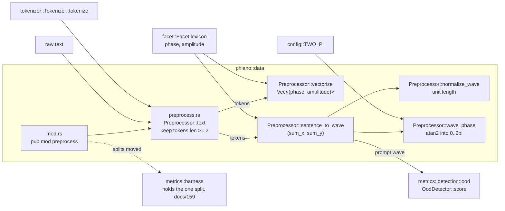

# data

```mermaid
graph LR
    Text["raw text"]
    Tok["tokenizer::Tokenizer::tokenize"]
    FacetN["facet::Facet.lexicon<br/>phase, amplitude"]
    Config["config::TWO_PI"]
    DriftOod["metrics::detection::ood<br/>OodDetector::score"]
    Harness["metrics::harness<br/>holds the one split, docs/159"]

    subgraph data["phiano::data"]
        ModD["mod.rs<br/>pub mod preprocess"]
        TextFn["preprocess.rs<br/>Preprocessor::text<br/>keep tokens len &gt;= 2"]
        VecFn["Preprocessor::vectorize<br/>Vec&lt;(phase, amplitude)&gt;"]
        WaveFn["Preprocessor::sentence_to_wave<br/>(sum_x, sum_y)"]
        Norm["Preprocessor::normalize_wave<br/>unit length"]
        Phase["Preprocessor::wave_phase<br/>atan2 into 0..2pi"]
    end

    ModD --> TextFn
    Text --> TextFn
    Tok --> TextFn
    TextFn -->|"tokens"| WaveFn
    TextFn -->|"tokens"| VecFn
    FacetN --> VecFn
    FacetN --> WaveFn
    WaveFn --> Norm
    WaveFn --> Phase
    Config --> Phase
    WaveFn -->|"prompt wave"| DriftOod
    ModD -.->|"splits moved"| Harness
```
