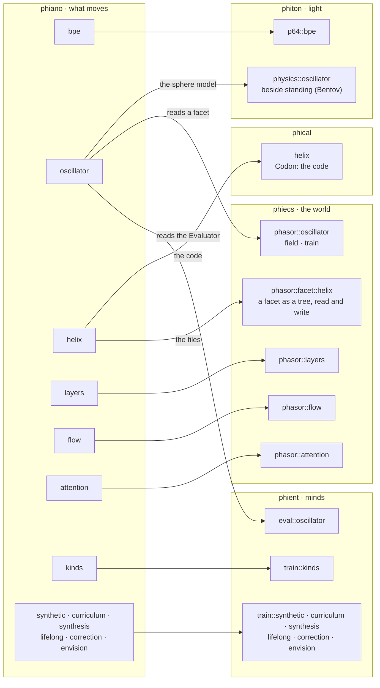
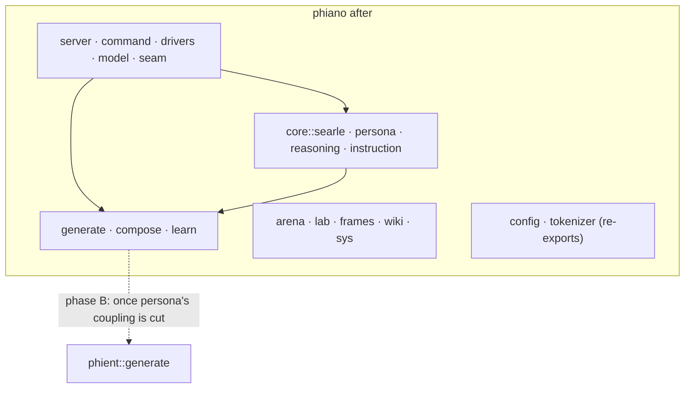

# phiano · distribution — architecture

## Where phiano's library modules go

```mermaid
graph LR
    subgraph phiano_["phiano · what moves"]
        bpe["bpe"]
        osc["oscillator"]
        helix["helix"]
        layers["layers"]
        flow["flow"]
        attention["attention"]
        kinds["kinds"]
        trainy["synthetic · curriculum · synthesis<br/>lifelong · correction · envision"]
    end
    subgraph phiton_["phiton · light"]
        p64bpe["p64::bpe"]
        oscphys["physics::oscillator<br/>beside standing (Bentov)"]
    end
    subgraph phical_["phical"]
        codon["helix<br/>Codon: the code"]
    end
    subgraph phiecs_["phiecs · the world"]
        fhelix["phasor::facet::helix<br/>a facet as a tree, read and write"]
        player["phasor::layers"]
        pflow["phasor::flow"]
        patt["phasor::attention"]
        posc["phasor::oscillator<br/>field · train"]
    end
    subgraph phient_["phient · minds"]
        eosc["eval::oscillator"]
        tkinds["train::kinds"]
        ttrain["train::synthetic · curriculum · synthesis<br/>lifelong · correction · envision"]
    end
    bpe --> p64bpe
    osc -->|"the sphere model"| oscphys
    osc -->|"reads a facet"| posc
    osc -->|"reads the Evaluator"| eosc
    helix -->|"the code"| codon
    helix -->|"the files"| fhelix
    layers --> player
    flow --> pflow
    attention --> patt
    kinds --> tkinds
    trainy --> ttrain
```

## What phiano keeps: the apps

```mermaid
graph TB
    subgraph apps["phiano after"]
        servers["server · command · drivers · model · seam"]
        minds["core::searle · persona · reasoning · instruction"]
        engine["generate · compose · learn"]
        bench["arena · lab · frames · wiki · sys"]
        glue["config · tokenizer (re-exports)"]
    end
    servers --> minds
    servers --> engine
    minds --> engine
    engine -.->|"phase B: once persona's coupling is cut"| later["phient::generate"]
```
