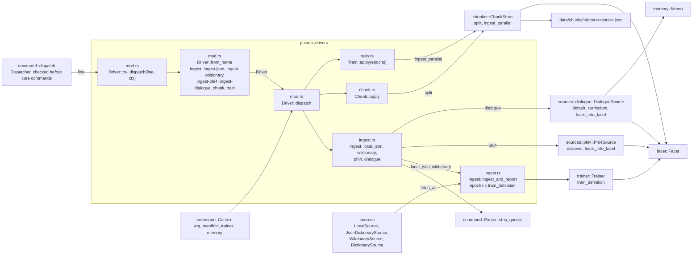

# drivers

```mermaid
graph LR
    Dispatcher["command::dispatch<br/>Dispatcher, checked before core commands"]
    Ctx["command::Context<br/>arg, manifold, trainer, memory"]
    Parser["command::Parser::strip_quotes"]
    Sources["sources<br/>LocalSource, JsonDictionarySource,<br/>WiktionarySource, DictionarySource"]
    Phi4["sources::phi4::Phi4Source<br/>discover, learn_into_facet"]
    Dialogue["sources::dialogue::DialogueSource<br/>default_curriculum, learn_into_facet"]
    Chunker["chunker::ChunkStore<br/>split, ingest_parallel"]
    ChunkFiles["data/chunks/&lt;letter&gt;/&lt;letter&gt;.json"]
    TrainerN["trainer::Trainer<br/>train_definition"]
    FacetN["facet::Facet"]
    MemoN["memory::Memo"]

    subgraph drivers["phiano::drivers"]
        TryD["mod.rs<br/>Driver::try_dispatch(line, ctx)"]
        FromName["mod.rs<br/>Driver::from_name<br/>ingest, ingest-json, ingest-wiktionary,<br/>ingest-phi4, ingest-dialogue, chunk, train"]
        Dispatch["mod.rs<br/>Driver::dispatch"]
        Ingest["ingest.rs<br/>Ingest: local, json, wiktionary,<br/>phi4, dialogue"]
        Report["ingest.rs<br/>Ingest::ingest_and_report<br/>epochs x train_definition"]
        ChunkD["chunk.rs<br/>Chunk::apply"]
        TrainD["train.rs<br/>Train::apply(epochs)"]
    end

    Dispatcher -->|"line"| TryD
    TryD --> FromName
    FromName -->|"Driver"| Dispatch
    Ctx --> Dispatch
    Dispatch --> Ingest
    Dispatch --> ChunkD
    Dispatch --> TrainD
    Ingest --> Parser
    Ingest -->|"local, json, wiktionary"| Report
    Sources -->|"fetch_all"| Report
    Report --> TrainerN
    TrainerN --> FacetN
    Ingest -->|"phi4"| Phi4
    Phi4 --> FacetN
    Ingest -->|"dialogue"| Dialogue
    Dialogue --> FacetN
    Dialogue --> MemoN
    ChunkD -->|"split"| Chunker
    TrainD -->|"ingest_parallel"| Chunker
    Chunker --> ChunkFiles
    Chunker --> FacetN
```
