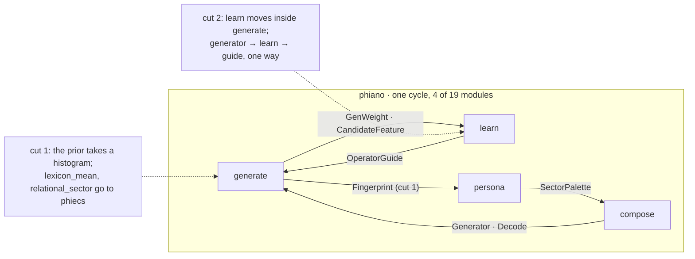
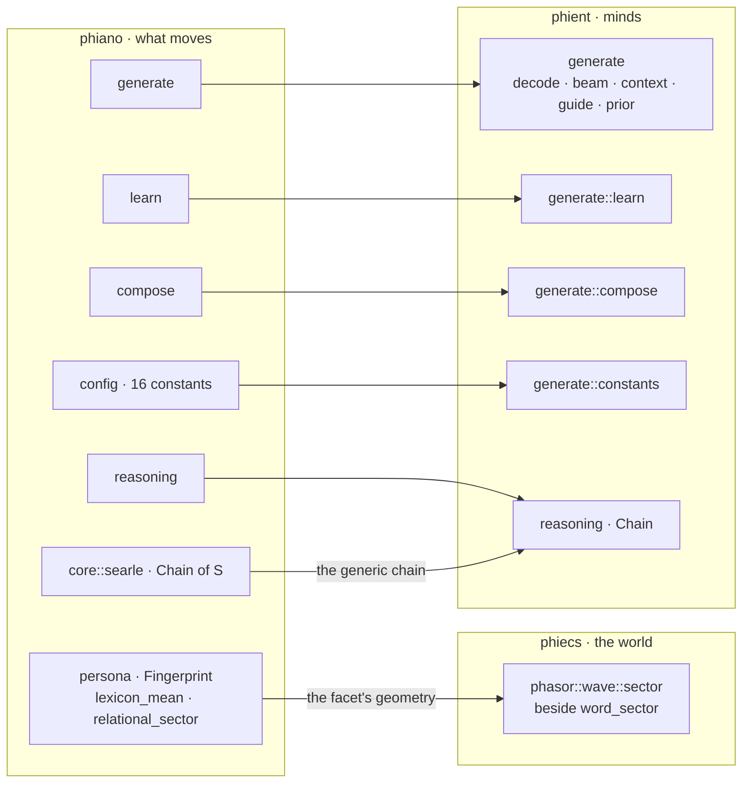
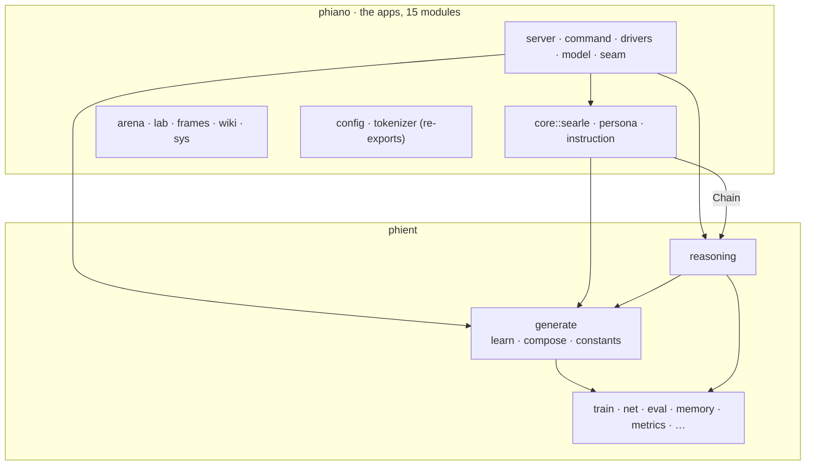

# phiano · engine (phase B) — architecture

## The cycle today, and its three cuts

```mermaid
graph LR
    subgraph cycle["phiano · one cycle, 4 of 19 modules"]
        generate["generate"]
        learn["learn"]
        compose["compose"]
        persona["persona"]
    end
    generate -->|"GenWeight · CandidateFeature"| learn
    learn -->|"OperatorGuide"| generate
    generate -->|"Fingerprint (cut 1)"| persona
    persona -->|"SectorPalette"| compose
    compose -->|"Generator · Decode"| generate
    cut1["cut 1: the prior takes a histogram;<br/>lexicon_mean, relational_sector go to phiecs"] -.-> generate
    cut2["cut 2: learn moves inside generate;<br/>generator → learn → guide, one way"] -.-> learn
```

## Where each part goes

```mermaid
graph LR
    subgraph phiano_["phiano · what moves"]
        gen["generate"]
        lrn["learn"]
        cmp["compose"]
        rsn["reasoning"]
        chain["core::searle · Chain of S"]
        fp["persona · Fingerprint<br/>lexicon_mean · relational_sector"]
        cfg["config · 16 constants"]
    end
    subgraph phiecs_["phiecs · the world"]
        sector["phasor::wave::sector<br/>beside word_sector"]
    end
    subgraph phient_["phient · minds"]
        pgen["generate<br/>decode · beam · context · guide · prior"]
        plrn["generate::learn"]
        pcmp["generate::compose"]
        pconst["generate::constants"]
        prsn["reasoning · Chain"]
    end
    gen --> pgen
    lrn --> plrn
    cmp --> pcmp
    cfg --> pconst
    rsn --> prsn
    chain -->|"the generic chain"| prsn
    fp -->|"the facet's geometry"| sector
```

## phiano and phient after

```mermaid
graph TB
    subgraph phiano_["phiano · the apps, 15 modules"]
        servers["server · command · drivers · model · seam"]
        minds["core::searle · persona · instruction"]
        bench["arena · lab · frames · wiki · sys"]
        glue["config · tokenizer (re-exports)"]
    end
    subgraph phient_["phient"]
        engine["generate<br/>learn · compose · constants"]
        reasoning["reasoning"]
        rest["train · net · eval · memory · metrics · …"]
    end
    servers --> minds
    servers --> engine
    servers --> reasoning
    minds --> engine
    minds -->|"Chain"| reasoning
    engine --> rest
    reasoning --> engine
    reasoning --> rest
```
