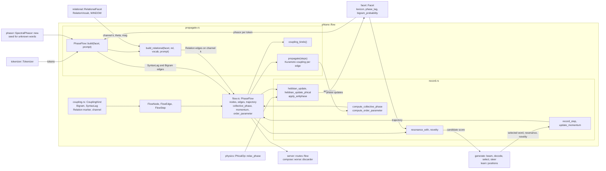

# flow

```mermaid
graph LR
    Tok["tokenizer::Tokenizer"]
    Facet["facet::Facet<br/>lexicon, phase_lag, bigram_probability"]
    Phasor["phasor::SpectralPhasor::new<br/>seed for unknown words"]
    Rel["relational::RelationalFacet<br/>RelationVocab, WINDOW"]
    Physics["physics::PhicalOp::relax_phase"]
    Gen["generate: beam, decode, select, steer<br/>learn::positions"]
    Users["server::routes::flow<br/>compose::worse::discarder"]

    subgraph flow["phiano::flow"]
        PF["flow.rs: PhaseFlow<br/>nodes, edges, trajectory<br/>collective_phase, momentum, order_parameter"]
        Parts["FlowNode, FlowEdge, FlowStep"]
        Coupling["coupling.rs: CouplingKind<br/>Bigram, SyntaxLag<br/>Relation marker, channel"]
        subgraph propagaters["propagate.rs"]
            Build["PhaseFlow::build(facet, prompt)"]
            BuildRel["build_relational(facet, rel, vocab, prompt)"]
            Prop["propagate(steps)<br/>Kuramoto coupling per edge"]
            Kinds["coupling_kinds()"]
        end
        subgraph recordrs["record.rs"]
            Step["record_step, update_momentum"]
            Reson["resonance_with, novelty"]
            Hebb["hebbian_update, hebbian_update_phical<br/>apply_antiphase"]
            Collective["compute_collective_phase<br/>compute_order_parameter"]
        end
    end

    Tok -->|"tokens"| Build
    Facet -->|"phasor per token"| Build
    Phasor --> Build
    Build -->|"SyntaxLag and Bigram edges"| PF
    Build --> BuildRel
    Rel -->|"channel k, theta, mag"| BuildRel
    BuildRel -->|"Relation edges on channel k"| PF
    Coupling --> Parts
    Parts --> PF
    PF --> Prop
    Prop -->|"activations"| Collective
    Collective --> PF
    PF --> Kinds
    Gen -->|"selected word, resonance, novelty"| Step
    Step -->|"trajectory"| PF
    PF --> Reson
    Facet --> Reson
    Reson -->|"candidate score"| Gen
    Physics --> Hebb
    PF --> Hebb
    Hebb -->|"phase updates"| Facet
    PF --> Users
```
