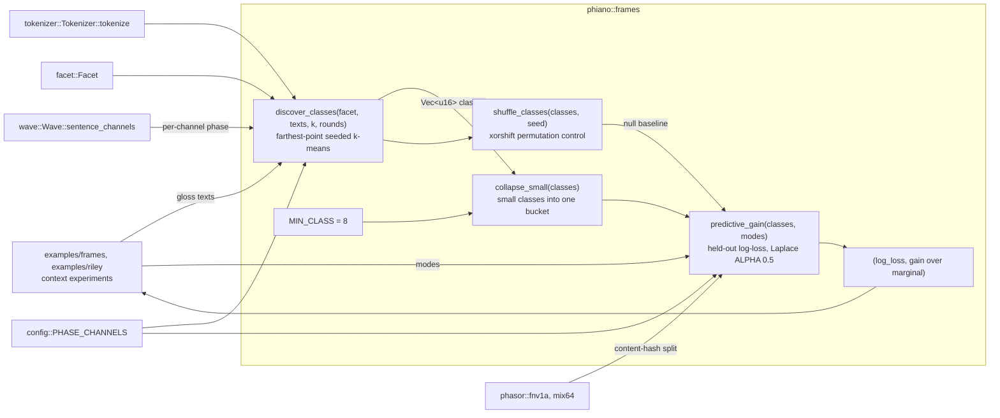

# frames

```mermaid
graph LR
    Examples["examples/frames, examples/riley<br/>context experiments"]
    Tok["tokenizer::Tokenizer::tokenize"]
    FacetN["facet::Facet"]
    WaveN["wave::Wave::sentence_channels"]
    Hash["phasor::fnv1a, mix64"]
    Config["config::PHASE_CHANNELS"]

    subgraph frames["phiano::frames"]
        Discover["discover_classes(facet, texts, k, rounds)<br/>farthest-point seeded k-means"]
        Shuffle["shuffle_classes(classes, seed)<br/>xorshift permutation control"]
        MinClass["MIN_CLASS = 8"]
        Collapse["collapse_small(classes)<br/>small classes into one bucket"]
        Gain["predictive_gain(classes, modes)<br/>held-out log-loss, Laplace ALPHA 0.5"]
        GainOut["(log_loss, gain over marginal)"]
    end

    Examples -->|"gloss texts"| Discover
    Tok --> Discover
    FacetN --> Discover
    WaveN -->|"per-channel phase"| Discover
    Config --> Discover
    Discover -->|"Vec&lt;u16&gt; classes"| Collapse
    MinClass --> Collapse
    Discover --> Shuffle
    Collapse --> Gain
    Shuffle -->|"null baseline"| Gain
    Examples -->|"modes"| Gain
    Hash -->|"content-hash split"| Gain
    Config --> Gain
    Gain --> GainOut
    GainOut --> Examples
```
