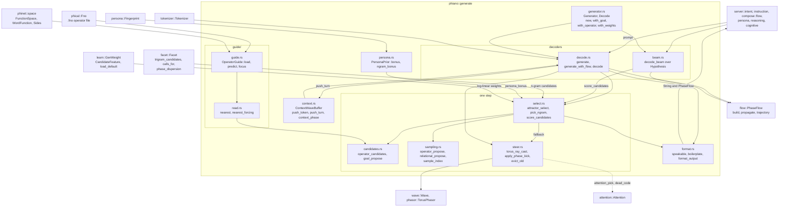

# generate

```mermaid
graph TB
    Callers["server::intent, instruction, compose::flow,<br/>persona, reasoning, cognitive"]
    FacetN["facet::Facet<br/>trigram_candidates, calls_for,<br/>phase_dispersion"]
    FlowN["flow::PhaseFlow<br/>build, propagate, trajectory"]
    LearnN["learn::GenWeight<br/>CandidateFeature, load_default"]
    Fno["phical::Fno<br/>.fno operator file"]
    Space["phinet::space<br/>FunctionSpace, WordFunction, Sides"]
    PersonaN["persona::Fingerprint"]
    Attention["attention::Attention"]
    WaveN["wave::Wave, phasor::TorusPhasor"]
    Tok["tokenizer::Tokenizer"]

    subgraph generate["phiano::generate"]
        Ctx["context.rs<br/>ContextWaveBuffer<br/>push_token, push_turn, context_phase"]
        Gen["generator.rs<br/>Generator, Decode<br/>new, with_goal, with_operator, with_weights"]
        Persona["persona.rs<br/>PersonaPrior: bonus, ngram_bonus"]

        subgraph guidedir["guide/"]
            Guide["guide.rs<br/>OperatorGuide::load, predict, focus"]
            Read["read.rs<br/>nearest, nearest_forcing"]
        end

        subgraph decoders["decoders"]
            Decode["decode.rs<br/>generate, generate_with_flow, decode"]
            Beam["beam.rs<br/>decode_beam over Hypothesis"]
        end

        subgraph step["one step"]
            Select["select.rs<br/>attractor_select, pick_ngram,<br/>score_candidates"]
            Cands["candidates.rs<br/>operator_candidates, goal_propose"]
            Sampling["sampling.rs<br/>operator_propose, relational_propose,<br/>sample_index"]
            Steer["steer.rs<br/>torus_ray_cast, apply_phase_kick,<br/>evict_old"]
        end

        Format["format.rs<br/>speakable, boilerplate, format_output"]
    end

    Callers -->|"prompt"| Decode
    Callers --> Beam
    Gen --> Decode
    Gen --> Beam
    Ctx --> Decode
    Decode -->|"push_turn"| Ctx
    Tok --> Decode
    Decode --> FlowN
    Beam --> FlowN
    Decode --> Select
    Beam -->|"score_candidates"| Select
    FacetN -->|"n-gram candidates"| Select
    Select --> Cands
    Select --> Sampling
    Fno --> Guide
    Space --> Guide
    Guide --> Read
    Read --> Cands
    PersonaN --> Persona
    Persona -->|"persona_bonus"| Select
    LearnN -->|"log-linear weights"| Select
    Select -->|"fallback"| Steer
    Decode --> Steer
    Steer --> WaveN
    Steer -.->|"attention_pick, dead_code"| Attention
    Select --> Format
    Decode --> Format
    Format -->|"String and PhaseFlow"| Callers
```
