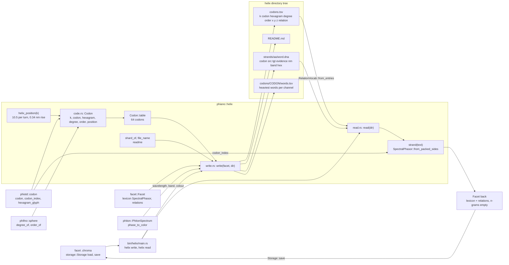

# helix

```mermaid
graph LR
    Chroma["facet .chroma<br/>storage::Storage load, save"]
    Bin["bin/helix/main.rs<br/>helix write, helix read"]
    Facet["facet::Facet<br/>lexicon SpectralPhasor, relations"]
    Codon["phistd::codon<br/>codon, codon_index, hexagram_glyph"]
    Sphere["phifno::sphere<br/>degree_of, order_of"]
    Phiton["phiton::PhitonSpectrum<br/>phase_to_color"]

    subgraph helix["phiano::helix"]
        CodonT["code.rs: Codon<br/>k, codon, hexagram, degree, order, position"]
        Pos["helix_position(k)<br/>10.5 per turn, 0.34 nm rise"]
        Table["Codon::table<br/>64 codons"]
        Write["write.rs: write(facet, dir)"]
        Names["shard_of, file_name<br/>readme"]
        Read["read.rs: read(dir)"]
        Strand["strand(text)<br/>SpectralPhasor::from_packed_sides"]
    end

    subgraph tree["helix directory tree"]
        Tsv["codons.tsv<br/>k codon hexagram degree order x y z relation"]
        Readme["README.md"]
        Strands["strands/aa/word.dna<br/>codon src tgt evidence nm band hex"]
        CodonDir["codons/CODON/words.tsv<br/>heaviest words per channel"]
    end

    Back["Facet back<br/>lexicon + relations, n-grams empty"]

    Chroma --> Bin
    Bin --> Write
    Facet --> Write
    Codon --> CodonT
    Sphere --> CodonT
    Pos --> CodonT
    CodonT --> Table
    Table --> Write
    Phiton -->|"wavelength, band, colour"| Write
    Names --> Write
    Write --> Tsv
    Write --> Readme
    Write --> Strands
    Write --> CodonDir
    Bin --> Read
    Tsv -->|"RelationVocab::from_entries"| Read
    Strands --> Read
    Read --> Strand
    Codon -->|"codon_index"| Strand
    Strand --> Back
    Back -->|"Storage::save"| Chroma
```
