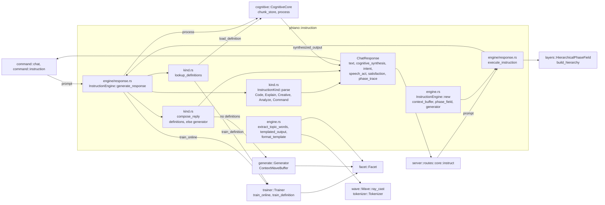

# instruction

```mermaid
graph LR
    Callers["command::chat, command::instruction"]
    Server["server::routes::core::instruct"]
    TrainerN["trainer::Trainer<br/>train_online, train_definition"]
    FacetN["facet::Facet"]
    Cognitive["cognitive::CognitiveCore<br/>chunk_store, process"]
    GenN["generate::Generator<br/>ContextWaveBuffer"]
    Layers["layers::HierarchicalPhaseField<br/>build_hierarchy"]
    WaveTok["wave::Wave::ray_cast<br/>tokenizer::Tokenizer"]

    subgraph instruction["phiano::instruction"]
        Engine["engine.rs<br/>InstructionEngine::new<br/>context_buffer, phase_field, generator"]
        Exec["engine/response.rs<br/>execute_instruction"]
        GenResp["engine/response.rs<br/>InstructionEngine::generate_response"]
        Kind["kind.rs<br/>InstructionKind::parse<br/>Code, Explain, Creative, Analyze, Command"]
        Lookup["kind.rs<br/>lookup_definitions"]
        Reply["kind.rs<br/>compose_reply<br/>definitions, else generator"]
        Topic["engine.rs<br/>extract_topic_words, templated_output,<br/>format_template"]
        ChatR["ChatResponse<br/>text, cognitive_synthesis, intent,<br/>speech_act, satisfaction, phase_trace"]
    end

    Callers -->|"prompt"| GenResp
    Server -->|"prompt"| Exec
    Engine --> Exec
    Exec --> Layers
    Exec --> GenResp
    GenResp -->|"train_online"| TrainerN
    TrainerN --> FacetN
    GenResp --> Kind
    GenResp --> Lookup
    Lookup -->|"load_definition"| Cognitive
    Lookup -->|"train_definition"| TrainerN
    GenResp -->|"process"| Cognitive
    GenResp --> Reply
    Reply -->|"no definitions"| GenN
    GenN --> FacetN
    Kind --> ChatR
    Reply --> ChatR
    Cognitive -->|"synthesized_output"| ChatR
    Topic --> WaveTok
    Topic --> FacetN
    ChatR --> Callers
    ChatR --> Server
```
