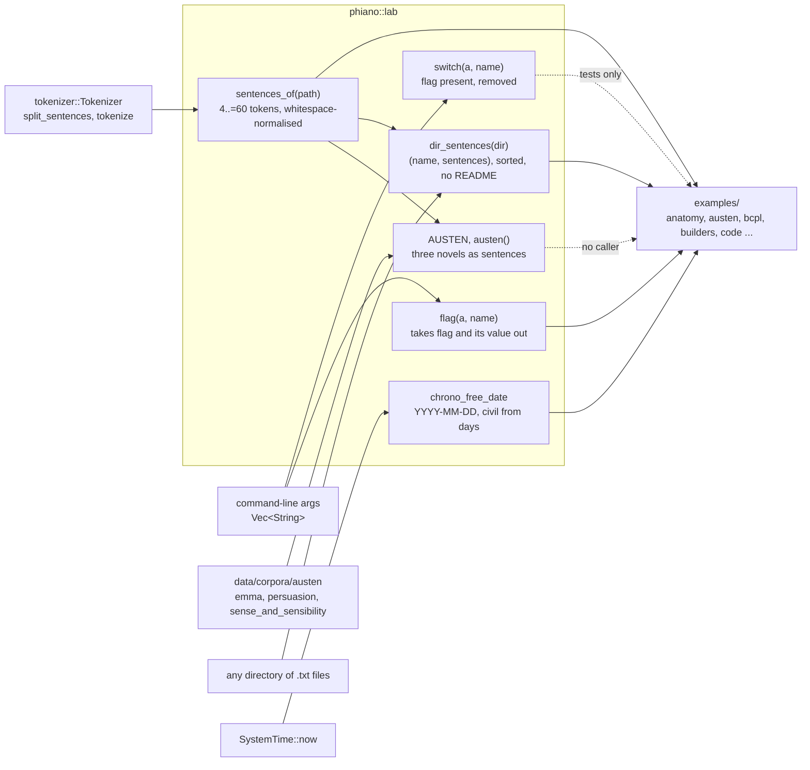

# lab

```mermaid
graph LR
    Args["command-line args<br/>Vec&lt;String&gt;"]
    Corpora["data/corpora/austen<br/>emma, persuasion, sense_and_sensibility"]
    AnyDir["any directory of .txt files"]
    Tok["tokenizer::Tokenizer<br/>split_sentences, tokenize"]
    Clock["SystemTime::now"]
    Examples["examples/<br/>anatomy, austen, bcpl, builders, code ..."]

    subgraph lab["phiano::lab"]
        Flag["flag(a, name)<br/>takes flag and its value out"]
        Switch["switch(a, name)<br/>flag present, removed"]
        Sentences["sentences_of(path)<br/>4..=60 tokens, whitespace-normalised"]
        Austen["AUSTEN, austen()<br/>three novels as sentences"]
        DirS["dir_sentences(dir)<br/>(name, sentences), sorted, no README"]
        Date["chrono_free_date<br/>YYYY-MM-DD, civil from days"]
    end

    Args --> Flag
    Args --> Switch
    Tok --> Sentences
    Corpora --> Austen
    AnyDir --> DirS
    Sentences --> Austen
    Sentences --> DirS
    Clock --> Date
    Flag --> Examples
    Sentences --> Examples
    DirS --> Examples
    Date --> Examples
    Switch -.->|"tests only"| Examples
    Austen -.->|"no caller"| Examples
```
