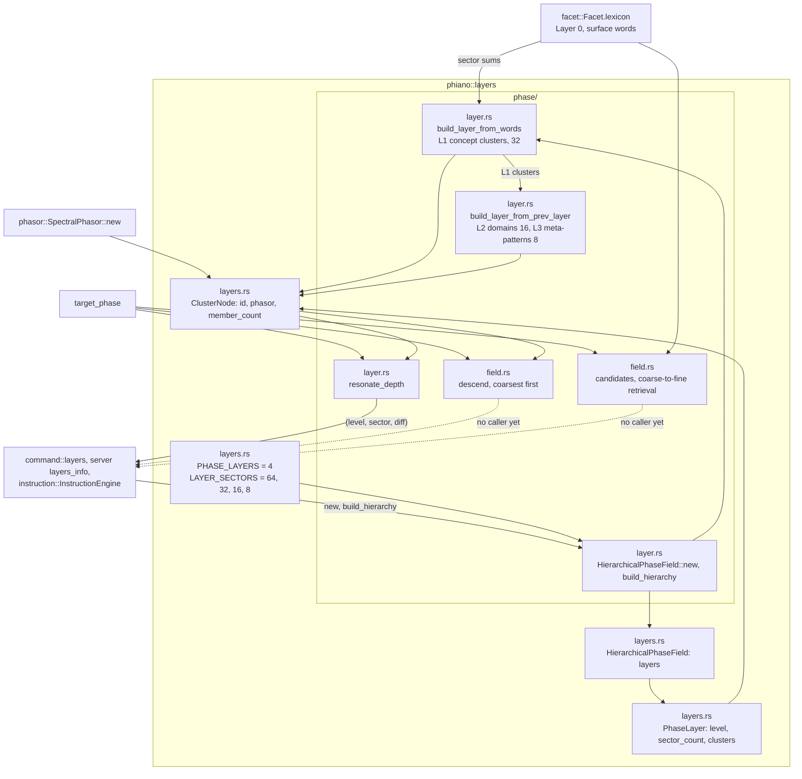

# layers

```mermaid
graph TB
    FacetN["facet::Facet.lexicon<br/>Layer 0, surface words"]
    Phasor["phasor::SpectralPhasor::new"]
    Callers["command::layers, server layers_info,<br/>instruction::InstructionEngine"]
    Target["target_phase"]

    subgraph layers["phiano::layers"]
        Consts["layers.rs<br/>PHASE_LAYERS = 4<br/>LAYER_SECTORS = 64, 32, 16, 8"]
        Field["layers.rs<br/>HierarchicalPhaseField: layers"]
        Layer["layers.rs<br/>PhaseLayer: level, sector_count, clusters"]
        Node["layers.rs<br/>ClusterNode: id, phasor, member_count"]

        subgraph phase["phase/"]
            Build["layer.rs<br/>HierarchicalPhaseField::new, build_hierarchy"]
            FromWords["layer.rs<br/>build_layer_from_words<br/>L1 concept clusters, 32"]
            FromPrev["layer.rs<br/>build_layer_from_prev_layer<br/>L2 domains 16, L3 meta-patterns 8"]
            Resonate["layer.rs<br/>resonate_depth"]
            Descend["field.rs<br/>descend, coarsest first"]
            Cands["field.rs<br/>candidates, coarse-to-fine retrieval"]
        end
    end

    Callers -->|"new, build_hierarchy"| Build
    Consts --> Build
    Build --> Field
    Field --> Layer
    Layer --> Node
    Build --> FromWords
    FacetN -->|"sector sums"| FromWords
    FromWords -->|"L1 clusters"| FromPrev
    FromWords --> Node
    FromPrev --> Node
    Phasor --> Node
    Target --> Resonate
    Target --> Descend
    Target --> Cands
    Node --> Resonate
    Node --> Descend
    FacetN --> Cands
    Resonate -->|"(level, sector, diff)"| Callers
    Descend -.->|"no caller yet"| Callers
    Cands -.->|"no caller yet"| Callers
```
