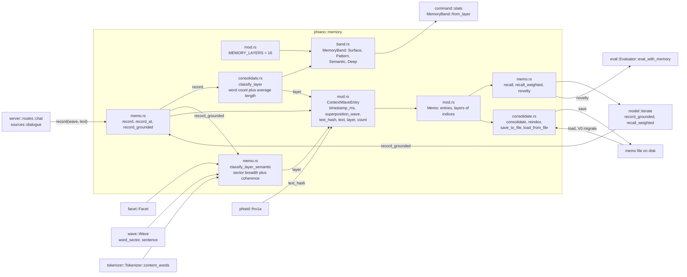

# memory

```mermaid
graph LR
    Recorders["server::routes::chat<br/>sources::dialogue"]
    Iterate["model::iterate<br/>record_grounded, recall_weighted"]
    EvalN["eval::Evaluator::eval_with_memory"]
    Stats["command::stats<br/>MemoryBand::from_layer"]
    FacetN["facet::Facet"]
    WaveN["wave::Wave<br/>word_sector, sentence"]
    Tok["tokenizer::Tokenizer::content_words"]
    Phistd["phistd::fnv1a"]
    MemoFile["memo file on disk"]

    subgraph memory["phiano::memory"]
        Consts["mod.rs<br/>MEMORY_LAYERS = 16"]
        MemoT["mod.rs<br/>Memo: entries, layers of indices"]
        Entry["mod.rs<br/>ContextWaveEntry<br/>timestamp_ms, superposition_wave,<br/>text_hash, text, layer, count"]
        Band["band.rs<br/>MemoryBand: Surface, Pattern,<br/>Semantic, Deep"]
        Record["memo.rs<br/>record, record_at, record_grounded"]
        Semantic["memo.rs<br/>classify_layer_semantic<br/>sector breadth plus coherence"]
        Surface["consolidate.rs<br/>classify_layer<br/>word count plus average length"]
        Recall["memo.rs<br/>recall, recall_weighted, novelty"]
        Consolidate["consolidate.rs<br/>consolidate, reindex,<br/>save_to_file, load_from_file"]
    end

    Recorders -->|"record(wave, text)"| Record
    Iterate -->|"record_grounded"| Record
    Record -->|"record"| Surface
    Record -->|"record_grounded"| Semantic
    FacetN --> Semantic
    WaveN --> Semantic
    Tok --> Semantic
    Surface --> Band
    Consts --> Band
    Band --> Stats
    Semantic -->|"layer"| Entry
    Surface -->|"layer"| Entry
    Phistd -->|"text_hash"| Entry
    Record --> Entry
    Entry --> MemoT
    MemoT --> Recall
    Recall --> Iterate
    Recall -->|"novelty"| EvalN
    MemoT --> Consolidate
    Consolidate -->|"save"| MemoFile
    MemoFile -->|"load, V0 migrate"| Consolidate
```
