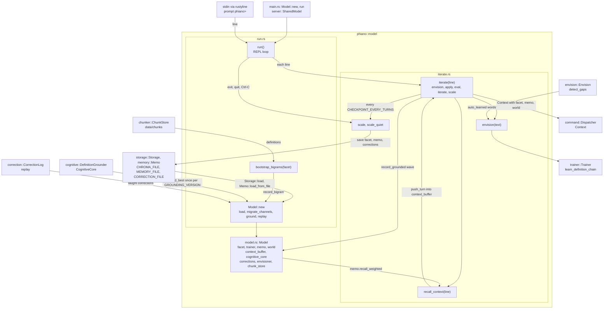

# model

```mermaid
graph TB
    User["stdin via rustyline<br/>prompt phiano&gt;"]
    Main["main.rs: Model::new, run<br/>server: SharedModel"]
    Disk["storage::Storage, memory::Memo<br/>CHROMA_FILE, MEMORY_FILE, CORRECTION_FILE"]
    Chunks["chunker::ChunkStore<br/>data/chunks"]
    Ground["cognitive::DefinitionGrounder<br/>CognitiveCore"]
    Corr["correction::CorrectionLog<br/>replay"]
    Disp["command::Dispatcher<br/>Context"]
    Env["envision::Envision<br/>detect_gaps"]
    Train["trainer::Trainer<br/>learn_definition_chain"]

    subgraph model["phiano::model"]
        Struct["model.rs: Model<br/>facet, trainer, memo, world<br/>context_buffer, cognitive_core<br/>corrections, envisioner, chunk_store"]
        subgraph runrs["run.rs"]
            New["Model::new<br/>load, migrate_channels, ground, replay"]
            Boot["bootstrap_bigrams(facet)"]
            Run["run()<br/>REPL loop"]
        end
        subgraph iteraters["iterate.rs"]
            Iter["iterate(line)<br/>envision, apply, eval, iterate, scale"]
            Recall["recall_context(line)"]
            Envis["envision(text)"]
            Scale["scale, scale_quiet"]
        end
    end

    Disk -->|"Storage::load, Memo::load_from_file"| New
    Chunks -->|"definitions"| Boot
    Boot -->|"record_bigram"| New
    Ground -->|"ground_best once per GROUNDING_VERSION"| New
    Corr -->|"taught corrections"| New
    New --> Struct
    Main --> Run
    User -->|"line"| Run
    Run -->|"each line"| Iter
    Iter --> Recall
    Struct -->|"memo.recall_weighted"| Recall
    Recall -->|"push_turn into context_buffer"| Iter
    Iter -->|"Context with facet, memo, world"| Disp
    Iter -->|"record_grounded wave"| Struct
    Iter --> Envis
    Env -->|"auto_learned words"| Envis
    Envis --> Train
    Iter -->|"every CHECKPOINT_EVERY_TURNS"| Scale
    Run -->|"exit, quit, Ctrl-C"| Scale
    Scale -->|"save facet, memo, corrections"| Disk
```
