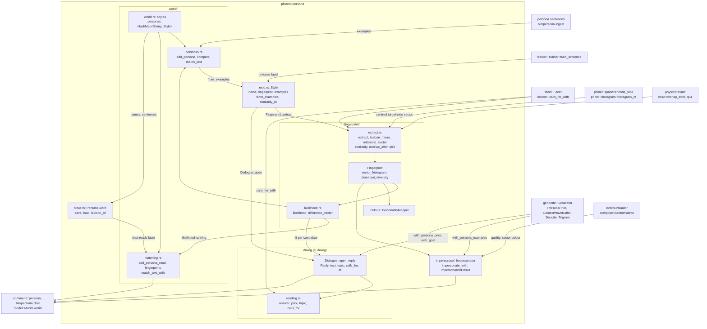

# persona

```mermaid
graph TB
    Corpus["persona sentences<br/>bin/persona ingest"]
    Facet["facet::Facet<br/>lexicon, calls_for_with"]
    Trainer["trainer::Trainer::train_sentence"]
    Space["phinet::space::encode_side<br/>phistd::hexagram::hexagram_of"]
    Exact["physics::exact<br/>heat::overlap_after, q64"]
    Gen["generate::Generator<br/>PersonaPrior, ContextWaveBuffer, Decode::Trigram"]
    Eval["eval::Evaluator<br/>compose::SectorPalette"]
    Users["command::persona, bin/persona chat<br/>model::Model.world"]

    subgraph persona["phiano::persona"]
        Persona["mod.rs: Style<br/>name, fingerprint, examples<br/>from_examples, similarity_to"]
        subgraph fingerprint["fingerprint/"]
            FP["Fingerprint<br/>sector_histogram, dominant, diversity"]
            Extract["extract.rs<br/>extract, lexicon_mean, relational_sector<br/>similarity, overlap_after, q64"]
            Lik["likelihood.rs<br/>likelihood, difference_vector"]
            Traits["traits.rs: PersonalityMapper"]
        end
        subgraph world["world/"]
            World["world.rs: Styles<br/>personas: HashMap&lt;String, Style&gt;"]
            Personas["personas.rs<br/>add_persona, compare, match_text"]
            Matching["matching.rs<br/>add_persona_read, fingerprints<br/>match_text_with"]
        end
        Store["store.rs: PersonaStore<br/>save, load, lexicon_of"]
        Imp["impersonate/: Impersonator<br/>impersonate_with, ImpersonationResult"]
        subgraph dialog["dialog.rs, dialog/"]
            Dia["Dialogue::open, reply<br/>Reply: text, topic, calls_for, fit"]
            Reading["reading.rs<br/>answer_pool, topic, calls_for"]
        end
    end

    Corpus -->|"examples"| Personas
    Personas -->|"from_examples"| Persona
    Trainer -->|"re-tunes facet"| Persona
    Persona -->|"Fingerprint::extract"| Extract
    Facet --> Extract
    Space -->|"centred target-side sector"| Extract
    Exact --> Extract
    Extract --> FP
    FP --> Lik
    FP --> Traits
    World --> Personas
    World --> Matching
    Lik -->|"likelihood ranking"| Matching
    Lik --> Personas
    World -->|"names, sentences"| Store
    Store -->|"load reads facet"| Matching
    FP --> Imp
    Gen -->|"with_persona_examples"| Imp
    Eval -->|"quality, sector colour"| Imp
    Persona -->|"Dialogue::open"| Dia
    Gen -->|"with_persona_prior, with_goal"| Dia
    Dia --> Reading
    Facet -->|"calls_for_with"| Reading
    Lik -->|"fit per candidate"| Dia
    Matching --> Users
    Imp --> Users
    Dia --> Users
```
