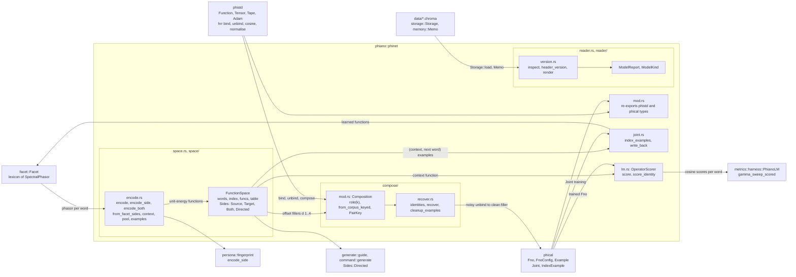

# phinet

```mermaid
graph LR
    Facet["facet::Facet<br/>lexicon of SpectralPhasor"]
    Files["data/*.chroma<br/>storage::Storage, memory::Memo"]
    Phistd["phistd<br/>Function, Tensor, Tape, Adam<br/>hrr bind, unbind, cosine, normalise"]
    Phical["phical<br/>Fno, FnoConfig, Example<br/>Joint, IndexExample"]
    Harness["metrics::harness::PhianoLM<br/>gamma_sweep_scored"]
    Guide["generate::guide, command::generate<br/>Sides::Directed"]
    Persona["persona::fingerprint<br/>encode_side"]

    subgraph phinet["phiano::phinet"]
        Mod["mod.rs<br/>re-exports phistd and phical types"]
        subgraph space["space.rs, space/"]
            FS["FunctionSpace<br/>words, index, funcs, table<br/>Sides: Source, Target, Both, Directed"]
            Enc["encode.rs<br/>encode, encode_side, encode_both<br/>from_facet_sides, context, pool, examples"]
        end
        subgraph reader["reader.rs, reader/"]
            Report["ModelReport, ModelKind"]
            Version["version.rs<br/>inspect, header_version, render"]
        end
        LM["lm.rs: OperatorScorer<br/>score, score_identity"]
        Joint["joint.rs<br/>index_examples, write_back"]
        subgraph compose["compose/"]
            Comp["mod.rs: Composition<br/>role(k), from_corpus_keyed, PairKey"]
            Recover["recover.rs<br/>identities, recover, cleanup_examples"]
        end
    end

    Phistd --> Mod
    Phical --> Mod
    Facet -->|"phasor per word"| Enc
    Enc -->|"unit-energy functions"| FS
    FS -->|"context function"| LM
    Phical -->|"trained Fno"| LM
    LM -->|"cosine scores per word"| Harness
    FS -->|"(context, next word) examples"| Joint
    Phical -->|"Joint training"| Joint
    Joint -->|"learned functions"| Facet
    FS -->|"offset fillers d 1..4"| Comp
    Phistd -->|"bind, unbind, compose"| Comp
    Comp --> Recover
    Recover -->|"noisy unbind to clean filler"| Phical
    Files -->|"Storage::load, Memo"| Version
    Version --> Report
    FS --> Guide
    Enc --> Persona
```
