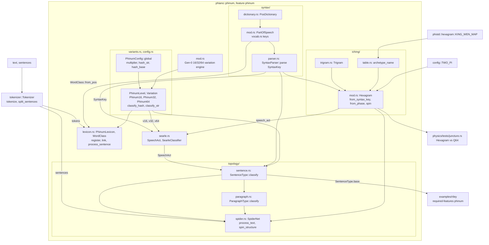

# phinum

```mermaid
graph TB
    Text["text, sentences"]
    Tok["tokenizer::Tokenizer<br/>tokenize, split_sentences"]
    Config["config::TWO_PI"]
    KingWen["phistd::hexagram::KING_WEN_MAP"]
    Riley["examples/riley<br/>required-features phinum"]
    Juncture["physics/tests/juncture.rs<br/>Hexagram vs Q64"]

    subgraph phinum["phiano::phinum, feature phinum"]
        Mod["mod.rs<br/>Gen-0 16/32/64 variation engine"]
        subgraph core["variants.rs, config.rs"]
            Variants["PhinumLevel, Variation<br/>Phinum16, Phinum32, Phinum64<br/>classify_hash, classify_str"]
            Cfg["PhinumConfig::global<br/>multiplier, hash_str, hash_base"]
        end
        subgraph syntax["syntax/"]
            POS["mod.rs: PartOfSpeech<br/>vocab.rs keys"]
            Dict["dictionary.rs: PosDictionary"]
            Parser["parser.rs: SyntaxParser::parse<br/>SyntaxKey"]
        end
        Searle["searle.rs<br/>SpeechAct, SearleClassifier"]
        subgraph iching["iching/"]
            Hex["mod.rs: Hexagram<br/>from_syntax_key, from_phase, spin"]
            Tri["trigram.rs: Trigram"]
            Table["table.rs: archetype_name"]
        end
        Lexicon["lexicon.rs: PhinumLexicon, WordClass<br/>register, link, process_sentence"]
        subgraph topology["topology/"]
            Sent["sentence.rs: SentenceType::classify"]
            Para["paragraph.rs: ParagraphType::classify"]
            Spider["spider.rs: SpiderNet<br/>process_text, spin_structure"]
        end
    end

    Text --> Tok
    Tok -->|"sentences"| Spider
    Tok -->|"tokens"| Lexicon
    Dict --> POS
    POS --> Parser
    Parser -->|"SyntaxKey"| Searle
    Cfg --> Variants
    Variants -->|"v16, v32, v64"| Searle
    Parser --> Hex
    Tri --> Hex
    KingWen --> Table
    Table --> Hex
    Config --> Hex
    Hex -->|"speech_act"| Searle
    Searle -->|"SpeechAct"| Sent
    Parser --> Sent
    Variants --> Sent
    Sent --> Para
    Sent --> Spider
    Para --> Spider
    Hex --> Spider
    POS -->|"WordClass::from_pos"| Lexicon
    Variants --> Lexicon
    Mod --> Variants
    Sent -->|"SentenceType.base"| Riley
    Hex --> Juncture
```
