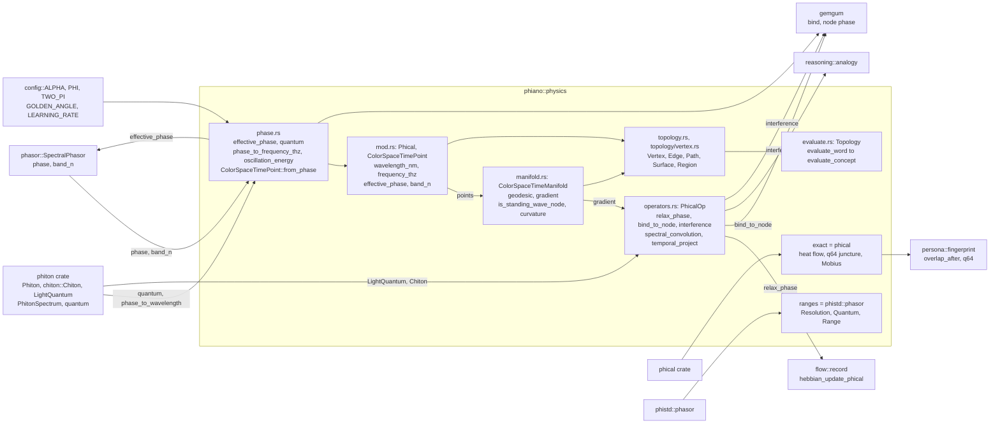

# physics

```mermaid
graph LR
    Phasor["phasor::SpectralPhasor<br/>phase, band_n"]
    Config["config::ALPHA, PHI, TWO_PI<br/>GOLDEN_ANGLE, LEARNING_RATE"]
    Phiton["phiton crate<br/>Phiton, chiton::Chiton, LightQuantum<br/>PhitonSpectrum, quantum"]
    PhicalCrate["phical crate"]
    PhistdRanges["phistd::phasor"]
    Flow["flow::record<br/>hebbian_update_phical"]
    Gemgum["gemgum<br/>bind, node phase"]
    Persona["persona::fingerprint<br/>overlap_after, q64"]
    Analogy["reasoning::analogy"]

    subgraph physics["phiano::physics"]
        Mod["mod.rs: Phical, ColorSpaceTimePoint<br/>wavelength_nm, frequency_thz<br/>effective_phase, band_n"]
        Phase["phase.rs<br/>effective_phase, quantum<br/>phase_to_frequency_thz, oscillation_energy<br/>ColorSpaceTimePoint::from_phase"]
        Manifold["manifold.rs: ColorSpaceTimeManifold<br/>geodesic, gradient<br/>is_standing_wave_node, curvature"]
        Ops["operators.rs: PhicalOp<br/>relax_phase, bind_to_node, interference<br/>spectral_convolution, temporal_project"]
        Topo["topology.rs, topology/vertex.rs<br/>Vertex, Edge, Path, Surface, Region"]
        Evaluate["evaluate.rs: Topology<br/>evaluate_word to evaluate_concept"]
        Exact["exact = phical<br/>heat flow, q64 juncture, Mobius"]
        Ranges["ranges = phistd::phasor<br/>Resolution, Quantum, Range"]
    end

    Phasor -->|"phase, band_n"| Phase
    Phiton -->|"quantum, phase_to_wavelength"| Phase
    Config --> Phase
    Phase --> Mod
    Mod -->|"points"| Manifold
    Manifold -->|"gradient"| Ops
    Phiton -->|"LightQuantum, Chiton"| Ops
    Mod --> Topo
    Manifold --> Topo
    Topo --> Evaluate
    PhicalCrate --> Exact
    PhistdRanges --> Ranges
    Phase -->|"effective_phase"| Phasor
    Ops -->|"relax_phase"| Flow
    Ops -->|"bind_to_node"| Gemgum
    Phase --> Gemgum
    Exact --> Persona
    Ops -->|"interference"| Analogy
    Ops -->|"interference"| Gemgum
```
