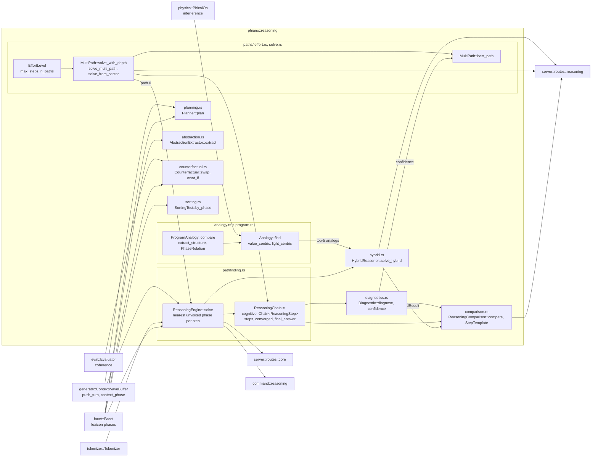

# reasoning

```mermaid
graph LR
    Facet["facet::Facet<br/>lexicon phases"]
    Tok["tokenizer::Tokenizer"]
    CWB["generate::ContextWaveBuffer<br/>push_turn, context_phase"]
    Evaluator["eval::Evaluator<br/>coherence"]
    Phys["physics::PhicalOp<br/>interference"]

    subgraph reasoning["phiano::reasoning"]
        subgraph pathfinding["pathfinding.rs"]
            Engine["ReasoningEngine::solve<br/>nearest unvisited phase per step"]
            Chain["ReasoningChain = cognitive::Chain&lt;ReasoningStep&gt;<br/>steps, converged, final_answer"]
        end
        subgraph paths["paths/ effort.rs, solve.rs"]
            Effort["EffortLevel<br/>max_steps, n_paths"]
            Multi["MultiPath::solve_with_depth<br/>solve_multi_path, solve_from_sector"]
            BestPath["MultiPath::best_path"]
        end
        subgraph analogies["analogy.rs + program.rs"]
            Analogy["Analogy::find<br/>value_centric, light_centric"]
            ProgAn["ProgramAnalogy::compare<br/>extract_structure, PhaseRelation"]
        end
        Hybrid["hybrid.rs<br/>HybridReasoner::solve_hybrid"]
        Diag["diagnostics.rs<br/>Diagnostic::diagnose, confidence"]
        Compare["comparison.rs<br/>ReasoningComparison::compare, StepTemplate"]
        Planner["planning.rs<br/>Planner::plan"]
        Abstr["abstraction.rs<br/>AbstractionExtractor::extract"]
        Counter["counterfactual.rs<br/>Counterfactual::swap, what_if"]
        Sorting["sorting.rs<br/>SortingTest::by_phase"]
    end

    RouteReason["server::routes::reasoning"]
    RouteCore["server::routes::core"]
    CmdReason["command::reasoning"]

    Facet --> Engine
    Tok --> Engine
    CWB --> Engine
    Engine --> Chain
    Effort --> Multi
    Multi -->|"path 0"| Engine
    Multi --> Chain
    Chain --> Diag
    Diag -->|"confidence"| BestPath
    Multi --> BestPath
    Engine --> Hybrid
    ProgAn --> Analogy
    Phys --> Analogy
    Analogy -->|"top-5 analogs"| Hybrid
    Hybrid -->|"HybridResult"| Compare
    Chain --> Compare
    Diag --> Compare
    Facet --> Planner
    CWB --> Planner
    Facet --> Abstr
    Facet --> Counter
    Evaluator --> Counter
    Facet --> Sorting
    Compare --> RouteReason
    Multi --> RouteReason
    Hybrid --> RouteReason
    Engine --> RouteCore
    Engine --> CmdReason
```
