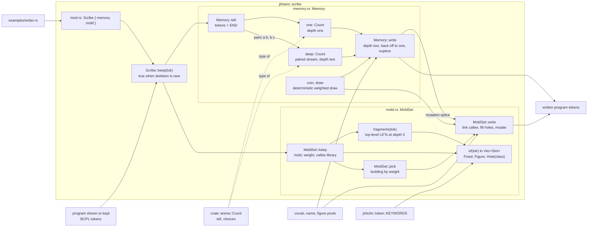

# scribe

```mermaid
graph LR
    Shown["program shown or kept<br/>BCPL tokens"]
    Pools["vocab, name, figure pools"]
    CountT["crate::arena::Count<br/>tell, choices"]
    Keywords["phiclm::token::KEYWORDS"]
    Writer["examples/writer.rs"]

    subgraph scribe["phiano::scribe"]
        Scribe["mod.rs: Scribe { memory, mold }"]
        SKeep["Scribe::keep(tok)<br/>true when skeleton is new"]
        subgraph memoryrs["memory.rs: Memory"]
            MTell["Memory::tell<br/>tokens + END"]
            One["one: Count<br/>depth one"]
            Deep["deep: Count<br/>paired stream, depth two"]
            MWrite["Memory::write<br/>depth two, back off to one, explore"]
            Coin["coin, draw<br/>deterministic weighted draw"]
        end
        subgraph moldrs["mold.rs: MoldSet"]
            Of["of(tok) to Vec&lt;Slot&gt;<br/>Fixed, Figure, Hole(class)"]
            Frag["fragments(tok)<br/>top-level LETs at depth 0"]
            MKeep["MoldSet::keep<br/>mold, weight, callee library"]
            Pick["MoldSet::pick<br/>building by weight"]
            MoldWrite["MoldSet::write<br/>link callee, fill holes, mutate"]
        end
    end

    Program["written program tokens"]

    Writer --> Scribe
    Shown --> SKeep
    Scribe --> SKeep
    SKeep --> MTell
    SKeep --> MKeep
    MTell --> One
    MTell -->|"pairs a b, b c"| Deep
    CountT -.->|"type of"| One
    CountT -.->|"type of"| Deep
    One --> MWrite
    Deep --> MWrite
    Coin --> MWrite
    Pools --> MWrite
    MKeep --> Frag
    Frag --> Of
    MKeep --> Of
    Keywords --> Of
    MKeep --> Pick
    Pick --> MoldWrite
    Pools --> MoldWrite
    Coin --> MoldWrite
    MWrite -->|"mutation splice"| MoldWrite
    MWrite --> Program
    MoldWrite --> Program
```
