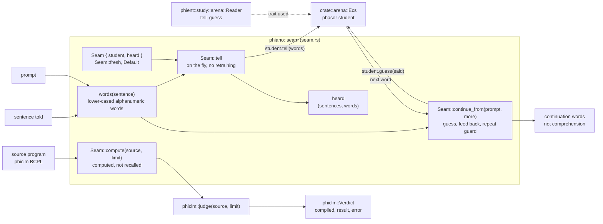

# seam

```mermaid
graph LR
    Sentence["sentence told"]
    Prompt["prompt"]
    Source["source program<br/>phiclm BCPL"]
    Ecs["crate::arena::Ecs<br/>phasor student"]
    ReaderT["phient::study::arena::Reader<br/>tell, guess"]
    Judge["phiclm::judge(source, limit)"]

    subgraph seam["phiano::seam (seam.rs)"]
        Words["words(sentence)<br/>lower-cased alphanumeric words"]
        Model["Seam { student, heard }<br/>Seam::fresh, Default"]
        Tell["Seam::tell<br/>on the fly, no retraining"]
        Heard["heard<br/>(sentences, words)"]
        Continue["Seam::continue_from(prompt, more)<br/>guess, feed back, repeat guard"]
        Compute["Seam::compute(source, limit)<br/>computed, not recalled"]
    end

    Out["continuation words<br/>not comprehension"]
    Verdict["phiclm::Verdict<br/>compiled, result, error"]

    Sentence --> Words
    Words --> Tell
    Model --> Tell
    Tell -->|"student.tell(words)"| Ecs
    Tell --> Heard
    ReaderT -.->|"trait used"| Ecs
    Prompt --> Words
    Words --> Continue
    Continue -->|"student.guess(said)"| Ecs
    Ecs -->|"next word"| Continue
    Continue --> Out
    Source --> Compute
    Compute --> Judge
    Judge --> Verdict
```
