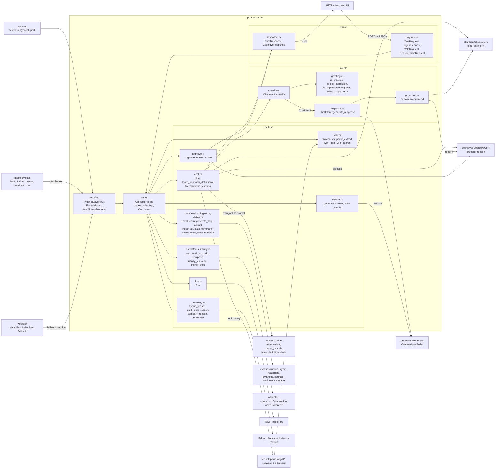

# server

```mermaid
graph LR
    MainRs["main.rs<br/>server::run(model, port)"]
    ModelN["model::Model<br/>facet, trainer, memo, cognitive_core"]
    Client["HTTP client, web UI"]
    WebDist["web/dist<br/>static files, index.html fallback"]
    Wikipedia["en.wikipedia.org API<br/>reqwest, 5 s timeout"]

    subgraph server["phiano::server"]
        ModRs["mod.rs<br/>PhianoServer::run<br/>SharedModel = Arc&lt;Mutex&lt;Model&gt;&gt;"]
        ApiRs["api.rs<br/>ApiRouter::build<br/>routes under /api, CorsLayer"]

        subgraph types["types/"]
            Req["requests.rs<br/>TextRequest, IngestRequest,<br/>WikiRequest, ReasonChainRequest"]
            Resp["response.rs<br/>ChatResponse, CognitiveResponse"]
        end

        subgraph routes["routes/"]
            RCore["core/ eval.rs, ingest.rs, define.rs<br/>eval, learn, generate_seq, instruct,<br/>ingest_all, stats, command, define_word, save_manifold"]
            RChat["chat.rs<br/>chat, learn_unknown_definitions,<br/>try_wikipedia_learning"]
            RWiki["wiki.rs<br/>WikiParser::parse_extract<br/>wiki_learn, wiki_search"]
            RCog["cognitive.rs<br/>cognitive, reason_chain"]
            RStream["stream.rs<br/>generate_stream, SSE events"]
            RReason["reasoning.rs<br/>hybrid_reason, multi_path_reason,<br/>compare_reason, benchmark"]
            ROsc["oscillator.rs, infinity.rs<br/>osc_eval, osc_train, compose,<br/>infinity_visualize, infinity_train"]
            RFlow["flow.rs<br/>flow"]
        end

        subgraph intent["intent/"]
            Classify["classify.rs<br/>ChatIntent::classify"]
            Patterns["greeting.rs<br/>is_greeting, is_self_correction,<br/>is_explanation_request, extract_topic_term"]
            Respond["response.rs<br/>ChatIntent::generate_response"]
            Grounded["grounded.rs<br/>explain, recommend"]
        end
    end

    Trainer["trainer::Trainer<br/>train_online, correct_mistake,<br/>learn_definition_chain"]
    Cognitive["cognitive::CognitiveCore<br/>process, reason"]
    Generate["generate::Generator<br/>ContextWaveBuffer"]
    Chunker["chunker::ChunkStore<br/>load_definition"]
    CoreDeps["eval, instruction, layers, reasoning,<br/>synthetic, sources, curriculum, storage"]
    PhysDeps["oscillator, compose::Composition,<br/>wave, tokenizer"]
    FlowMod["flow::PhaseFlow"]
    Lifelong["lifelong::BenchmarkHistory, metrics"]

    MainRs --> ModRs
    ModelN -->|"Arc Mutex"| ModRs
    WebDist -->|"fallback_service"| ModRs
    ModRs --> ApiRs
    Client -->|"POST /api JSON"| Req
    Req --> ApiRs
    ApiRs --> RCore
    ApiRs --> RChat
    ApiRs --> RWiki
    ApiRs --> RCog
    ApiRs --> RStream
    ApiRs --> RReason
    ApiRs --> ROsc
    ApiRs --> RFlow

    RChat -->|"train_online prompt"| Trainer
    RChat --> Chunker
    RChat -->|"topic query"| Wikipedia
    Wikipedia --> RWiki
    RChat -->|"process"| Cognitive
    RChat --> Classify
    Classify --> Patterns
    Classify -->|"ChatIntent"| Respond
    Respond --> Grounded
    Respond --> Generate
    Grounded --> Chunker
    Grounded -->|"reason"| Cognitive

    RCog --> Cognitive
    RStream -->|"decode"| Generate
    RCore --> CoreDeps
    ROsc --> PhysDeps
    RFlow --> FlowMod
    RReason --> Lifelong

    RChat --> Resp
    RCog --> Resp
    Resp -->|"Json"| Client
```
