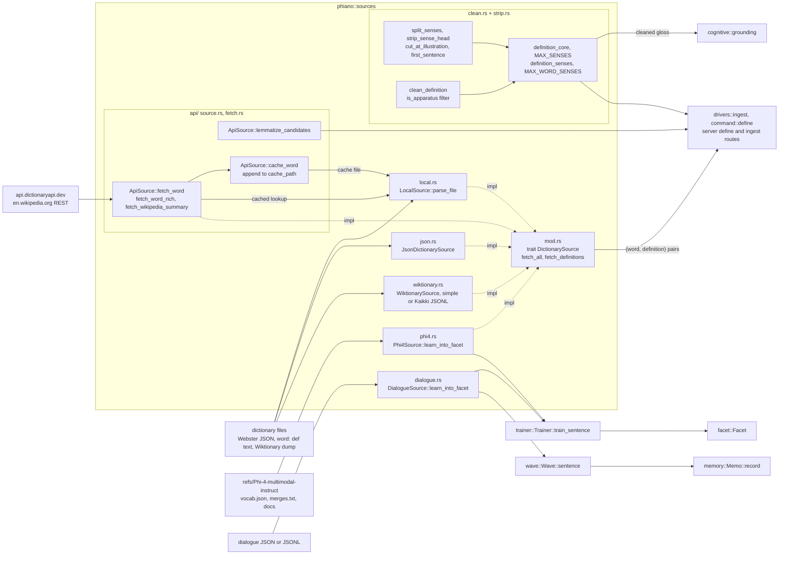

# sources

```mermaid
graph LR
    Files["dictionary files<br/>Webster JSON, word: def text, Wiktionary dump"]
    Web["api.dictionaryapi.dev<br/>en.wikipedia.org REST"]
    Refs["refs/Phi-4-multimodal-instruct<br/>vocab.json, merges.txt, docs"]
    DlgFile["dialogue JSON or JSONL"]

    subgraph sources["phiano::sources"]
        Trait["mod.rs<br/>trait DictionarySource<br/>fetch_all, fetch_definitions"]
        Local["local.rs<br/>LocalSource::parse_file"]
        Json["json.rs<br/>JsonDictionarySource"]
        Wikt["wiktionary.rs<br/>WiktionarySource, simple or Kaikki JSONL"]
        subgraph apidir["api/ source.rs, fetch.rs"]
            Api["ApiSource::fetch_word<br/>fetch_word_rich, fetch_wikipedia_summary"]
            Lemma["ApiSource::lemmatize_candidates"]
            Cache["ApiSource::cache_word<br/>append to cache_path"]
        end
        Phi4["phi4.rs<br/>Phi4Source::learn_into_facet"]
        Dlg["dialogue.rs<br/>DialogueSource::learn_into_facet"]
        subgraph cleaning["clean.rs + strip.rs"]
            Split["split_senses, strip_sense_head<br/>cut_at_illustration, first_sentence"]
            Clean["clean_definition<br/>is_apparatus filter"]
            Core["definition_core, MAX_SENSES<br/>definition_senses, MAX_WORD_SENSES"]
        end
    end

    Trainer["trainer::Trainer::train_sentence"]
    Wave["wave::Wave::sentence"]
    Memo["memory::Memo::record"]
    Facet["facet::Facet"]
    Users["drivers::ingest, command::define<br/>server define and ingest routes"]
    Grounding["cognitive::grounding"]

    Files --> Local
    Files --> Json
    Files --> Wikt
    Web --> Api
    Lemma --> Users
    Api --> Cache
    Cache -->|"cache file"| Local
    Api -->|"cached lookup"| Local
    Local -.->|"impl"| Trait
    Json -.->|"impl"| Trait
    Wikt -.->|"impl"| Trait
    Api -.->|"impl"| Trait
    Phi4 -.->|"impl"| Trait
    Refs --> Phi4
    DlgFile --> Dlg
    Phi4 --> Trainer
    Dlg --> Trainer
    Dlg --> Wave
    Wave --> Memo
    Trainer --> Facet
    Trait -->|"(word, definition) pairs"| Users
    Split --> Core
    Clean --> Core
    Core -->|"cleaned gloss"| Grounding
    Core --> Users
```
