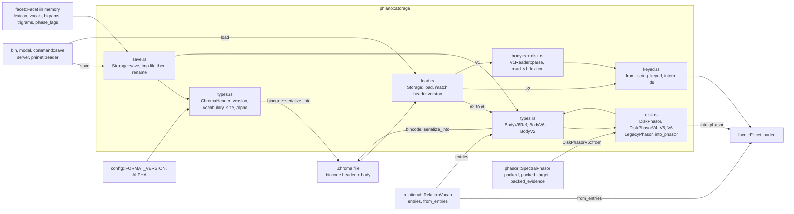

# storage

```mermaid
graph LR
    FacetIn["facet::Facet in memory<br/>lexicon, vocab, bigrams, trigrams, phase_lags"]
    Phasor["phasor::SpectralPhasor<br/>packed, packed_target, packed_evidence"]
    Config["config::FORMAT_VERSION, ALPHA"]
    Users["bin, model, command::save<br/>server, phinet::reader"]

    subgraph storage["phiano::storage"]
        Save["save.rs<br/>Storage::save, tmp file then rename"]
        Header["types.rs<br/>ChromaHeader: version, vocabulary_size, alpha"]
        Bodies["types.rs<br/>BodyV6Ref, BodyV6 ... BodyV2"]
        Disk["disk.rs<br/>DiskPhasor, DiskPhasorV4, V5, V6<br/>LegacyPhasor, into_phasor"]
        Load["load.rs<br/>Storage::load, match header.version"]
        V1["body.rs + disk.rs<br/>V1Reader::parse, read_v1_lexicon"]
        Keyed["keyed.rs<br/>from_string_keyed, intern ids"]
    end

    Chroma[".chroma file<br/>bincode header + body"]
    Rel["relational::RelationVocab<br/>entries, from_entries"]
    FacetOut["facet::Facet loaded"]

    Users -->|"save"| Save
    FacetIn --> Save
    Phasor -->|"DiskPhasorV6::from"| Disk
    Config --> Header
    Save --> Header
    Save --> Bodies
    Disk --> Bodies
    Rel -->|"entries"| Bodies
    Header -->|"bincode::serialize_into"| Chroma
    Bodies -->|"bincode::serialize_into"| Chroma
    Users -->|"load"| Load
    Chroma --> Load
    Load -->|"v3 to v6"| Bodies
    Load -->|"v2"| Keyed
    Load -->|"v1"| V1
    V1 --> Keyed
    Bodies --> Disk
    Disk -->|"into_phasor"| FacetOut
    Keyed --> FacetOut
    Rel -->|"from_entries"| FacetOut
```
