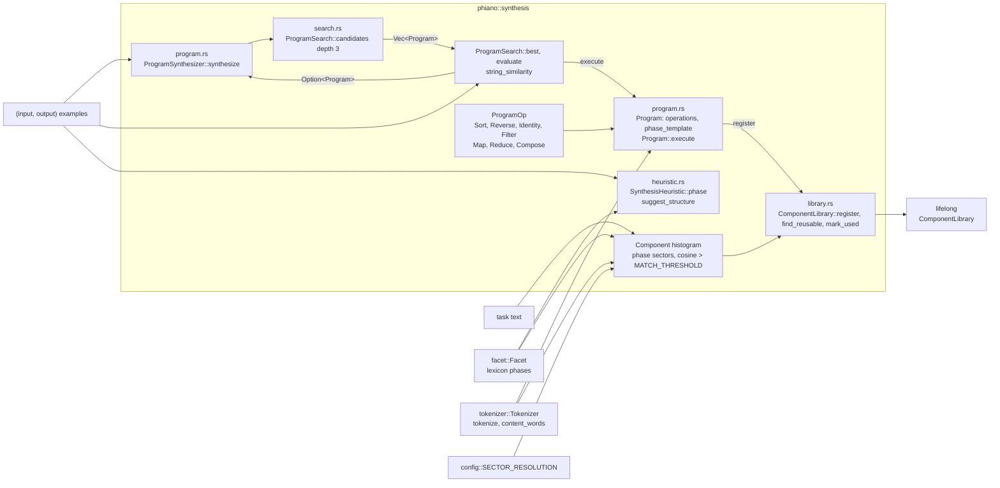

# synthesis

```mermaid
graph LR
    Examples["(input, output) examples"]
    Task["task text"]
    Facet["facet::Facet<br/>lexicon phases"]
    Tok["tokenizer::Tokenizer<br/>tokenize, content_words"]
    Config["config::SECTOR_RESOLUTION"]

    subgraph synthesis["phiano::synthesis"]
        Synth["program.rs<br/>ProgramSynthesizer::synthesize"]
        Cands["search.rs<br/>ProgramSearch::candidates depth 3"]
        Best["ProgramSearch::best, evaluate<br/>string_similarity"]
        Prog["program.rs<br/>Program: operations, phase_template<br/>Program::execute"]
        Ops["ProgramOp<br/>Sort, Reverse, Identity, Filter<br/>Map, Reduce, Compose"]
        Heur["heuristic.rs<br/>SynthesisHeuristic::phase<br/>suggest_structure"]
        Lib["library.rs<br/>ComponentLibrary::register, find_reusable, mark_used"]
        Hist["Component histogram<br/>phase sectors, cosine &gt; MATCH_THRESHOLD"]
    end

    Lifelong["lifelong<br/>ComponentLibrary"]

    Examples --> Synth
    Synth --> Cands
    Cands -->|"Vec&lt;Program&gt;"| Best
    Examples --> Best
    Ops --> Prog
    Tok --> Prog
    Best -->|"execute"| Prog
    Best -->|"Option&lt;Program&gt;"| Synth
    Examples --> Heur
    Facet --> Heur
    Prog -->|"register"| Lib
    Task --> Hist
    Facet --> Hist
    Tok --> Hist
    Config --> Hist
    Hist --> Lib
    Lib --> Lifelong
```
