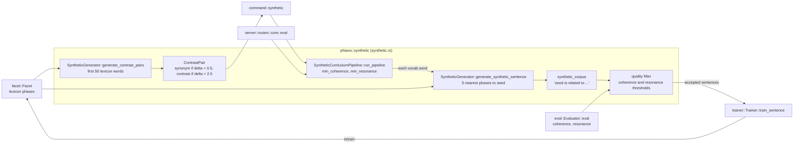

# synthetic

```mermaid
graph LR
    Facet["facet::Facet<br/>lexicon phases"]
    Evaluator["eval::Evaluator::eval<br/>coherence, resonance"]
    Trainer["trainer::Trainer::train_sentence"]

    subgraph synthetic["phiano::synthetic (synthetic.rs)"]
        Pipe["SyntheticCurriculumPipeline::run_pipeline<br/>min_coherence, min_resonance"]
        Gen["SyntheticGenerator::generate_synthetic_sentence<br/>5 nearest phases to seed"]
        Corpus["synthetic_corpus<br/>'seed is related to ...'"]
        Filter["quality filter<br/>coherence and resonance thresholds"]
        Contrast["SyntheticGenerator::generate_contrast_pairs<br/>first 50 lexicon words"]
        Pair["ContrastPair<br/>synonym if delta &lt; 0.5, contrast if delta &gt; 2.5"]
    end

    Cmd["command::synthetic"]
    Route["server::routes::core::eval"]

    Cmd --> Pipe
    Route --> Pipe
    Pipe -->|"each vocab word"| Gen
    Facet --> Gen
    Gen --> Corpus
    Corpus --> Filter
    Evaluator --> Filter
    Filter -->|"accepted sentences"| Trainer
    Trainer -->|"retrain"| Facet
    Facet --> Contrast
    Contrast --> Pair
    Pair --> Cmd
```
