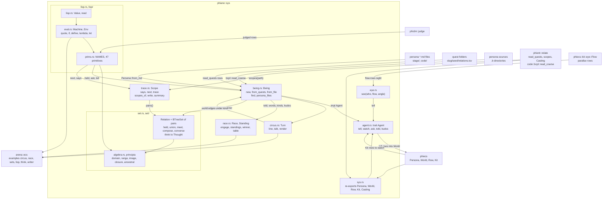

# sys

```mermaid
graph TB
    MdFiles["persona *.md files<br/>stage/, code/"]
    Quests["quest folders<br/>slug/seed/relations.tsv"]
    BSrc["persona sources<br/>.b directories"]
    Phiecs["phiecs<br/>Persona, World, Row, Kit"]
    Phient["phient::relate<br/>read_quests, scopes, Casting<br/>code::bcpl::read_coarse"]
    EyeFlow["phiecs::kit::eye::Flow<br/>parallax rows"]
    Phiclm["phiclm::judge"]
    Users["arena::ecs<br/>examples circus, race, sets, lisp, think, writer"]

    subgraph sys["phiano::sys"]
        SysRs["sys.rs<br/>re-exports Persona, World, Row, Kit, Casting"]
        Agent["agent.rs: trait Agent<br/>tell, watch, ask, told, kudos"]
        Being["being.rs: Being<br/>new, from_quests, from_file<br/>find, persona_files"]
        Eye["eye.rs<br/>see(who, flow, angle)"]
        Circus["circus.rs: Turn<br/>line, talk, render"]
        Race["race.rs: Race, Standing<br/>engage, standings, winner, table"]
        subgraph setmod["set.rs, set/"]
            SetRs["Relation = BTreeSet of pairs<br/>held, union, meet, compose, converse<br/>think to Thought"]
            Algebra["algebra.rs, principia<br/>domain, range, image, closure, ancestral"]
        end
        Trace["trace.rs: Scope<br/>says, next, trace<br/>scopes_of, write, summary"]
        subgraph lispmod["lisp.rs, lisp/"]
            LispRs["lisp.rs: Value, read"]
            Eval["eval.rs: Machine, Env<br/>quote, if, define, lambda, let"]
            Prims["prims.rs: NAMES, 47 primitives"]
        end
    end

    Phiecs --> SysRs
    Phient --> SysRs
    SysRs --> Agent
    MdFiles -->|"Persona::from_md"| Being
    Quests -->|"read_quests rows"| Being
    BSrc -->|"bcpl::read_coarse"| Being
    Being -->|"impl Agent"| Agent
    Agent -->|"tell rows into World"| Phiecs
    Phiecs -->|"Kit rows to watch"| Agent
    EyeFlow -->|"flow.rows sight"| Eye
    Eye -->|"tell"| Agent
    Being --> Circus
    Circus -->|"heard row told to listener"| Being
    Being -->|"told, words, kinds, kudos"| Race
    Being -->|"world edges under kind"| SetRs
    SetRs --> Algebra
    Phient -->|"scopes(path)"| Trace
    Trace -->|"pairs()"| SetRs
    LispRs --> Eval
    Eval --> Prims
    Prims --> Algebra
    Prims -->|"held, ask, tell"| Being
    Prims -->|"next, says"| Trace
    Phiclm -->|"judged rows"| Prims
    Race --> Users
    Circus --> Users
    Eval --> Users
```
