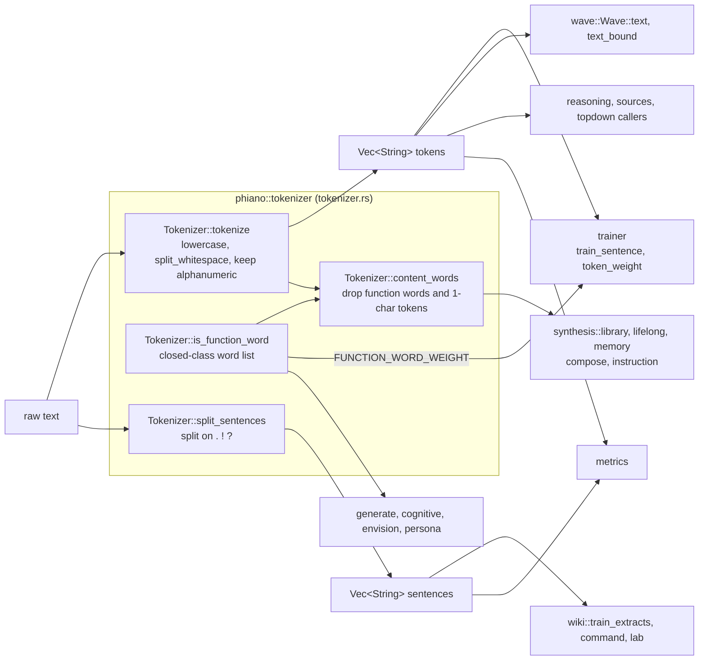

# tokenizer

```mermaid
graph LR
    Text["raw text"]

    subgraph tokenizer["phiano::tokenizer (tokenizer.rs)"]
        Tokenize["Tokenizer::tokenize<br/>lowercase, split_whitespace, keep alphanumeric"]
        IsFn["Tokenizer::is_function_word<br/>closed-class word list"]
        Content["Tokenizer::content_words<br/>drop function words and 1-char tokens"]
        Split["Tokenizer::split_sentences<br/>split on . ! ?"]
    end

    Tokens["Vec&lt;String&gt; tokens"]
    Sentences["Vec&lt;String&gt; sentences"]
    Trainer["trainer<br/>train_sentence, token_weight"]
    Wave["wave::Wave::text, text_bound"]
    Reasoning["reasoning, sources, topdown callers"]
    Synthesis["synthesis::library, lifelong, memory<br/>compose, instruction"]
    Wiki["wiki::train_extracts, command, lab"]
    Gen["generate, cognitive, envision, persona"]
    Metrics["metrics"]

    Text --> Tokenize
    Text --> Split
    Tokenize --> Tokens
    Tokenize --> Content
    IsFn --> Content
    Tokens --> Trainer
    Tokens --> Wave
    Tokens --> Reasoning
    Tokens --> Metrics
    IsFn -->|"FUNCTION_WORD_WEIGHT"| Trainer
    IsFn --> Gen
    Content --> Synthesis
    Split --> Sentences
    Sentences --> Wiki
    Sentences --> Metrics
```
