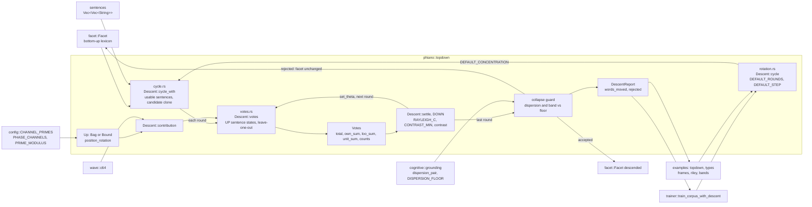

# topdown

```mermaid
graph LR
    Facet["facet::Facet<br/>bottom-up lexicon"]
    Sents["sentences<br/>Vec&lt;Vec&lt;String&gt;&gt;"]
    Grounding["cognitive::grounding<br/>dispersion_pair, DISPERSION_FLOOR"]
    Config["config::CHANNEL_PRIMES<br/>PHASE_CHANNELS, PRIME_MODULUS"]
    C64["wave::c64"]
    Trainer["trainer::train_corpus_with_descent"]
    Examples["examples: topdown, types<br/>frames, riley, bands"]

    subgraph topdown["phiano::topdown"]
        Cycle["rotation.rs<br/>Descent::cycle<br/>DEFAULT_ROUNDS, DEFAULT_STEP"]
        CycleWith["cycle.rs<br/>Descent::cycle_with<br/>usable sentences, candidate clone"]
        UpMode["Up: Bag or Bound<br/>position_rotation"]
        Contrib["Descent::contribution"]
        Votes["votes.rs<br/>Descent::votes<br/>UP sentence states, leave-one-out"]
        VotesT["Votes<br/>total, own_sum, loo_sum, unit_sum, counts"]
        Settle["Descent::settle, DOWN<br/>RAYLEIGH_C, CONTRAST_MIN, contrast"]
        Guard["collapse guard<br/>dispersion and band vs floor"]
        Report["DescentReport<br/>words_moved, rejected"]
    end

    FacetOut["facet::Facet descended"]

    Trainer --> Cycle
    Examples --> Cycle
    Cycle -->|"DEFAULT_CONCENTRATION"| CycleWith
    Facet --> CycleWith
    Sents --> CycleWith
    CycleWith -->|"each round"| Votes
    Config --> UpMode
    UpMode --> Contrib
    C64 --> Contrib
    Contrib --> Votes
    Votes --> VotesT
    VotesT --> Settle
    Settle -->|"set_theta, next round"| Votes
    Settle -->|"last round"| Guard
    Grounding --> Guard
    Guard -->|"accepted"| FacetOut
    Guard -->|"rejected: facet unchanged"| Facet
    Guard --> Report
    Report --> Trainer
    Report --> Examples
```
