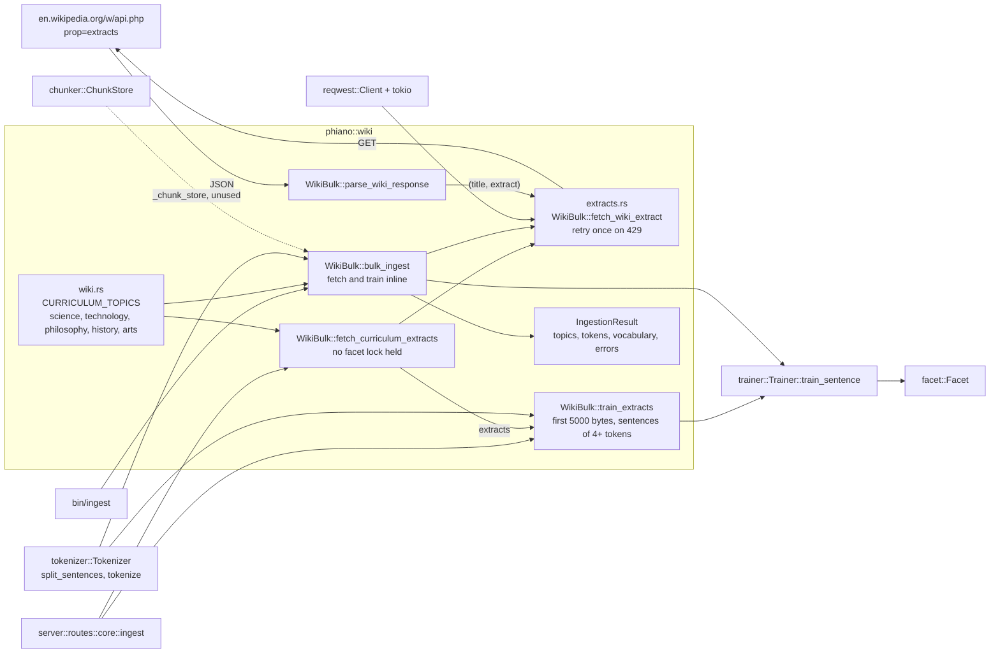

# wiki

```mermaid
graph LR
    WikiApi["en.wikipedia.org/w/api.php<br/>prop=extracts"]
    Http["reqwest::Client + tokio"]
    Tok["tokenizer::Tokenizer<br/>split_sentences, tokenize"]
    Trainer["trainer::Trainer::train_sentence"]
    Chunk["chunker::ChunkStore"]

    subgraph wiki["phiano::wiki"]
        Topics["wiki.rs<br/>CURRICULUM_TOPICS<br/>science, technology, philosophy, history, arts"]
        Fetch["extracts.rs<br/>WikiBulk::fetch_wiki_extract<br/>retry once on 429"]
        Parse["WikiBulk::parse_wiki_response"]
        FetchAll["WikiBulk::fetch_curriculum_extracts<br/>no facet lock held"]
        TrainEx["WikiBulk::train_extracts<br/>first 5000 bytes, sentences of 4+ tokens"]
        Bulk["WikiBulk::bulk_ingest<br/>fetch and train inline"]
        IngRes["IngestionResult<br/>topics, tokens, vocabulary, errors"]
    end

    Facet["facet::Facet"]
    RouteIngest["server::routes::core::ingest"]
    BinIngest["bin/ingest"]

    RouteIngest --> FetchAll
    RouteIngest --> TrainEx
    BinIngest --> Bulk
    Topics --> FetchAll
    Topics --> Bulk
    FetchAll --> Fetch
    Bulk --> Fetch
    Http --> Fetch
    Fetch -->|"GET"| WikiApi
    WikiApi -->|"JSON"| Parse
    Parse -->|"(title, extract)"| Fetch
    FetchAll -->|"extracts"| TrainEx
    Tok --> TrainEx
    Tok --> Bulk
    TrainEx --> Trainer
    Bulk --> Trainer
    Trainer --> Facet
    Bulk --> IngRes
    Chunk -.->|"_chunk_store, unused"| Bulk
```
