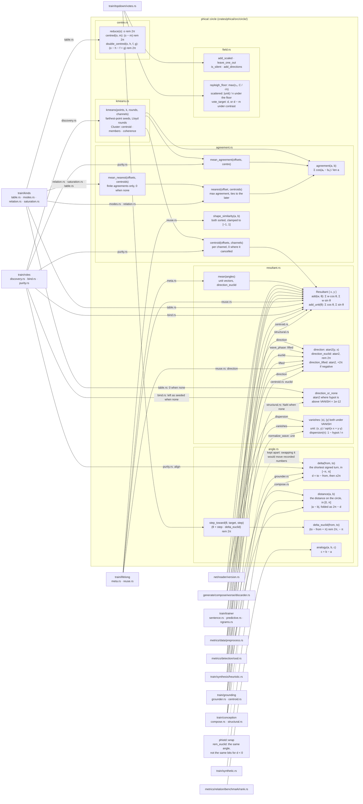

# circle

```mermaid
graph LR
    subgraph circle["phical::circle (crates/phical/src/circle/)"]
        subgraph angle_["angle.rs"]
            Delta["delta(from, to)<br/>the shortest signed turn, in [−π, π]<br/>d = to − from, then ±2π"]
            Distance["distance(a, b)<br/>the distance on the circle, in [0, π]<br/>|a − b|, folded as 2π − d"]
            DeltaE["delta_euclid(from, to)<br/>(to − from + π) rem 2π, − π"]
            Step["step_toward(θ, target, step)<br/>(θ + step · delta_euclid) rem 2π"]
            Analogy["analogy(a, b, c)<br/>c + b − a"]
        end
        subgraph resultant_["resultant.rs"]
            Res["Resultant { x, y }<br/>add(w, θ): Σ w·cos θ, Σ w·sin θ<br/>add_unit(θ): Σ cos θ, Σ sin θ"]
            Dir["direction: atan2(y, x)<br/>direction_euclid: atan2, rem 2π<br/>direction_lifted: atan2, +2π if negative"]
            DirN["direction_or_none<br/>atan2 where hypot is above VANISH = 1e-12"]
            Misc["vanishes: |x|, |y| both under VANISH<br/>unit: (x, y) / sqrt(x·x + y·y)<br/>dispersion(n): 1 − hypot / n"]
            Mean["mean(angles)<br/>unit vectors, direction_euclid"]
        end
        subgraph agreement_["agreement.rs"]
            Agree["agreement(a, b)<br/>Σ cos(aₖ − bₖ) / len a"]
            Nearest["nearest(offset, centroids)<br/>max agreement, ties to the later"]
            Centroid["centroid(offsets, channels)<br/>per channel, 0 where it cancelled"]
            MeanAgree["mean_agreement(offsets, centre)"]
            MeanNearest["mean_nearest(offsets, centroids)<br/>finite agreements only, 0 when none"]
            Shape["shape_similarity(a, b)<br/>both sorted, clamped to [−1, 1]"]
        end
        subgraph kmeans_["kmeans.rs"]
            KMeans["kmeans(points, k, rounds, channels)<br/>farthest-point seeds, Lloyd rounds<br/>Cluster: centroid · members · coherence"]
        end
        subgraph centre_["centre.rs"]
            Centre["reduce(o): o rem 2π<br/>centred(o, m): (o − m) rem 2π<br/>double_centred(o, h, f, g): (o − h − f + g) rem 2π"]
        end
        subgraph field_["field.rs"]
            Votes["add_scaled · leave_one_out<br/>is_silent · add_directions"]
            Settle["rayleigh_floor: max(c₀, C / √n)<br/>scattered: |unit| / n under the floor<br/>vote_target: d, or d − m under contrast"]
        end
    end

    Wrap["phistd::wrap<br/>rem_euclid: the same angle,<br/>not the same bits for d &lt; 0"]

    Conception["train/conception<br/>compose.rs · structural.rs"]
    Grounding["train/grounding<br/>grounder.rs · centroid.rs"]
    Trainer["train/trainer<br/>sentence.rs · predictive.rs · ngrams.rs"]
    Roles["train/roles<br/>discovery.rs · bind.rs · purity.rs"]
    Kinds["train/kinds<br/>table.rs · modes.rs · relation.rs · saturation.rs"]
    Lifelong["train/lifelong<br/>meta.rs · reuse.rs"]
    Synthesis["train/synthesis/heuristic.rs"]
    Synthetic["train/synthetic.rs"]
    Topdown["train/topdown/votes.rs"]
    Ood["metrics/detection/ood.rs"]
    Pre["metrics/data/preprocess.rs"]
    Rank["metrics/relation/benchmark/rank.rs"]
    Discarder["generate/compose/worse/discarder.rs"]
    Version["net/reader/version.rs"]

    Conception -->|"compose.rs"| Delta
    Conception -->|"structural.rs"| Res
    Conception -->|"structural.rs: NaN when none"| DirN
    Grounding -->|"grounder.rs"| Delta
    Grounding -->|"centroid.rs"| Res
    Grounding -->|"centroid.rs: euclid"| Dir
    Trainer --> Res
    Trainer -->|"direction"| Dir
    Roles -->|"discovery.rs"| KMeans
    Roles -->|"bind.rs"| Res
    Roles -->|"bind.rs: left as seeded when none"| DirN
    Roles -->|"purity.rs"| Centroid
    Roles -->|"purity.rs"| MeanAgree
    Roles -->|"purity.rs: align"| Delta
    Kinds -->|"table.rs"| Res
    Kinds -->|"table.rs: 0 when none"| DirN
    Kinds -->|"table.rs"| Centre
    Kinds -->|"modes.rs · relation.rs"| Nearest
    Kinds -->|"relation.rs · saturation.rs · table.rs"| MeanNearest
    Lifelong -->|"meta.rs"| Mean
    Lifelong -->|"reuse.rs"| Res
    Lifelong -->|"reuse.rs: direction"| Dir
    Lifelong -->|"reuse.rs"| Shape
    Synthesis --> Distance
    Synthesis --> Res
    Synthesis -->|"lifted"| Dir
    Synthetic --> Distance
    Topdown --> Votes
    Topdown --> Settle
    Topdown --> Step
    Ood --> Distance
    Ood --> Res
    Ood -->|"euclid"| Dir
    Pre --> Res
    Pre -->|"wave_phase: lifted"| Dir
    Pre -->|"normalize_wave: unit"| Misc
    Rank --> Analogy
    Discarder --> Res
    Discarder -->|"vanishes"| Misc
    Discarder -->|"direction"| Dir
    Version -->|"dispersion"| Misc
    Version --> Res

    Step --> DeltaE
    Mean --> Res
    Centroid --> Res
    Nearest --> Agree
    MeanAgree --> Agree
    MeanNearest --> Nearest
    KMeans --> Agree & Centroid & MeanAgree
    Wrap -.->|"kept apart: swapping it would move recorded numbers"| Delta
```
