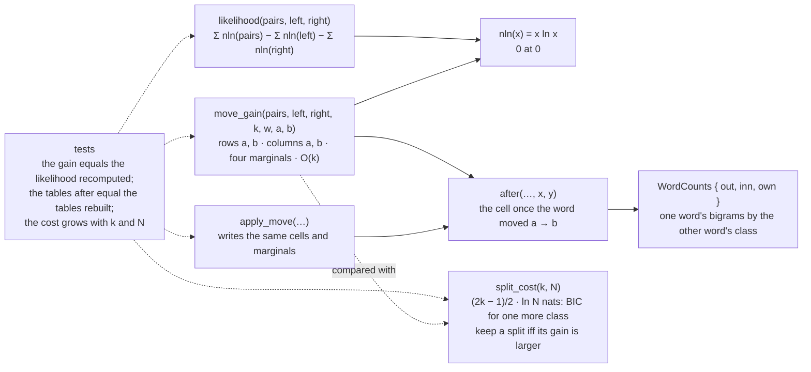
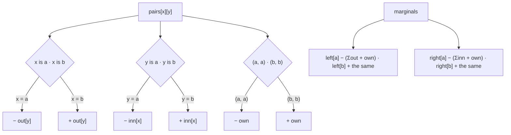
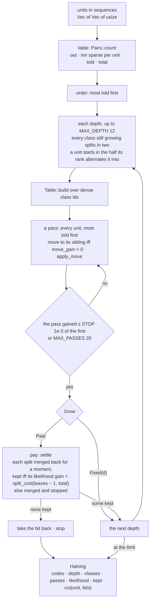
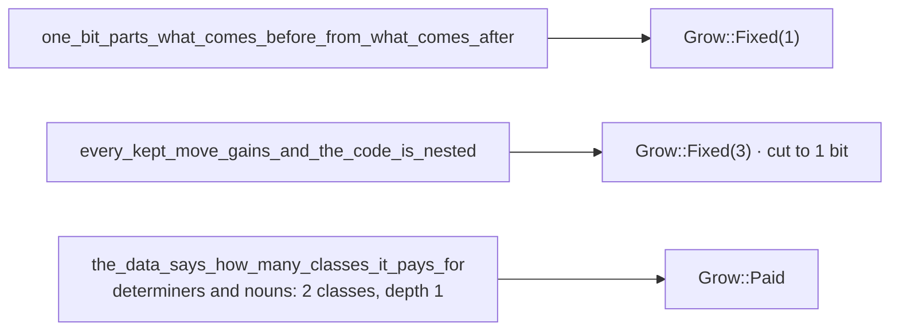
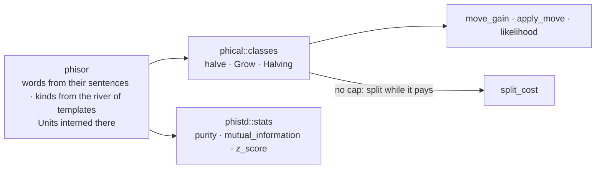

# classes

## Inside classes.rs

```mermaid
graph LR
    nln["nln(x) = x ln x<br/>0 at 0"]
    lik["likelihood(pairs, left, right)<br/>Σ nln(pairs) − Σ nln(left) − Σ nln(right)"]
    wc["WordCounts { out, inn, own }<br/>one word's bigrams by the other word's class"]
    after["after(…, x, y)<br/>the cell once the word moved a → b"]
    gain["move_gain(pairs, left, right, k, w, a, b)<br/>rows a, b · columns a, b · four marginals · O(k)"]
    apply["apply_move(…)<br/>writes the same cells and marginals"]
    cost["split_cost(k, N)<br/>(2k − 1)/2 · ln N nats: BIC for one more class<br/>keep a split iff its gain is larger"]
    tests["tests<br/>the gain equals the likelihood recomputed;<br/>the tables after equal the tables rebuilt;<br/>the cost grows with k and N"]
    lik --> nln
    gain --> after & nln
    apply --> after
    after --> wc
    tests -.-> lik & gain & apply & cost
    gain -.->|"compared with"| cost
```

## One move, cell by cell

```mermaid
flowchart TD
    c["pairs[x][y]"] --> r{"x is a · x is b"}
    r -->|"x = a"| ra["− out[y]"]
    r -->|"x = b"| rb["+ out[y]"]
    c --> col{"y is a · y is b"}
    col -->|"y = a"| ca["− inn[x]"]
    col -->|"y = b"| cb["+ inn[x]"]
    c --> own{"(a, a) · (b, b)"}
    own -->|"(a, a)"| oa["− own"]
    own -->|"(b, b)"| ob["+ own"]
    m["marginals"] --> lm["left[a] − (Σout + own) · left[b] + the same"]
    m --> rm["right[a] − (Σinn + own) · right[b] + the same"]
```

## The exchange: classes/halve · pay · table

```mermaid
flowchart TD
    seq["units in sequences<br/>Vec of Vec of usize"] --> pairs["table: Pairs::count<br/>out · inn sparse per unit · told · total"]
    pairs --> order["order: most told first"]
    order --> depth["each depth, up to MAX_DEPTH 12<br/>every class still growing splits in two<br/>a unit starts in the half its rank alternates it into"]
    depth --> build["Table::build over dense class ids"]
    build --> pass["a pass: every unit, most told first<br/>move to its sibling iff move_gain #gt; 0 · apply_move"]
    pass --> stop{"the pass gained ≤ STOP 1e-3 of the first<br/>or MAX_PASSES 20"}
    stop -->|"no"| pass
    stop -->|"yes"| grow{"Grow"}
    grow -->|"Fixed(d)"| next["the next depth"]
    grow -->|"Paid"| settle["pay: settle<br/>each split merged back for a moment;<br/>kept iff its likelihood gain #gt; split_cost(leaves − 1, total)<br/>else merged and stopped"]
    settle -->|"some kept"| next
    settle -->|"none kept"| back["take the bit back · stop"]
    next --> depth
    back --> out["Halving<br/>codes · depth · classes · passes · likelihood · kept · cut(unit, bits)"]
    next -->|"at the limit"| out
```

```mermaid
graph LR
    t1["one_bit_parts_what_comes_before_from_what_comes_after"] --> f1["Grow::Fixed(1)"]
    t2["every_kept_move_gains_and_the_code_is_nested"] --> f3["Grow::Fixed(3) · cut to 1 bit"]
    t3["the_data_says_how_many_classes_it_pays_for<br/>determiners and nouns: 2 classes, depth 1"] --> paid["Grow::Paid"]
```

## Who calls it

```mermaid
graph LR
    phisor["phisor<br/>words from their sentences · kinds from the river of templates<br/>Units interned there"] --> halve["phical::classes<br/>halve · Grow · Halving"]
    halve --> gain["move_gain · apply_move · likelihood"]
    halve -->|"no cap: split while it pays"| cost2["split_cost"]
    phisor --> stats["phistd::stats<br/>purity · mutual_information · z_score"]
```
