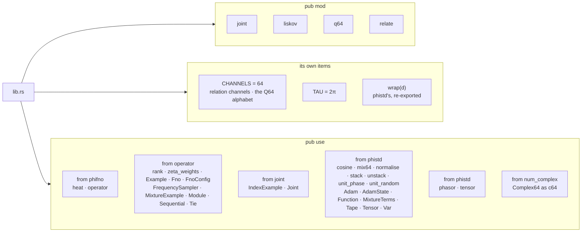
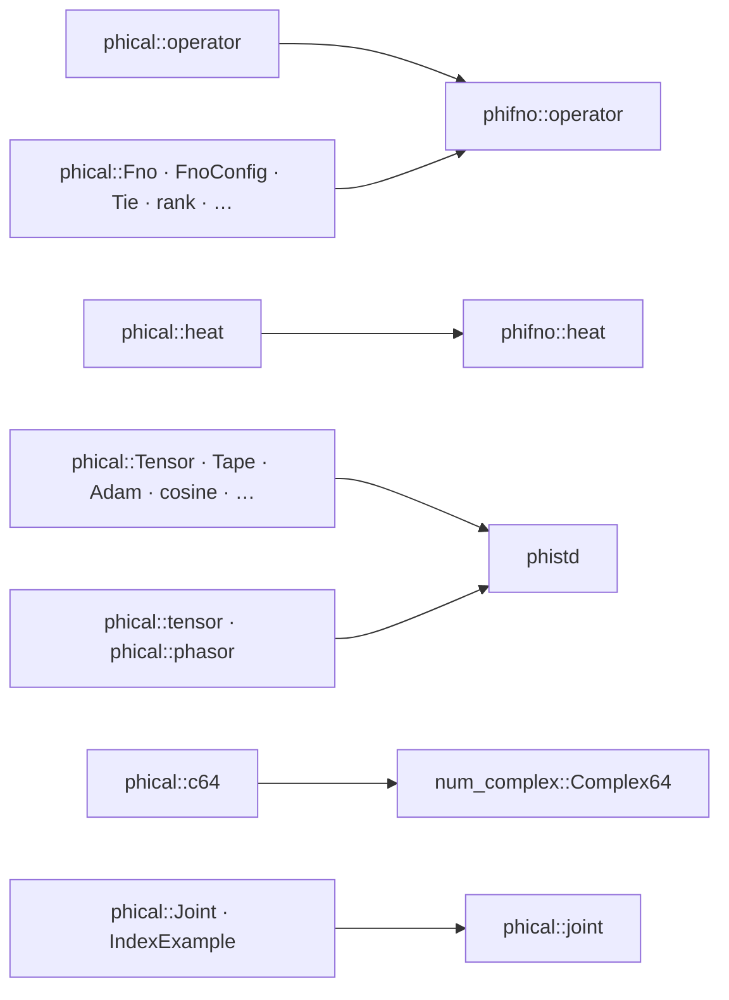
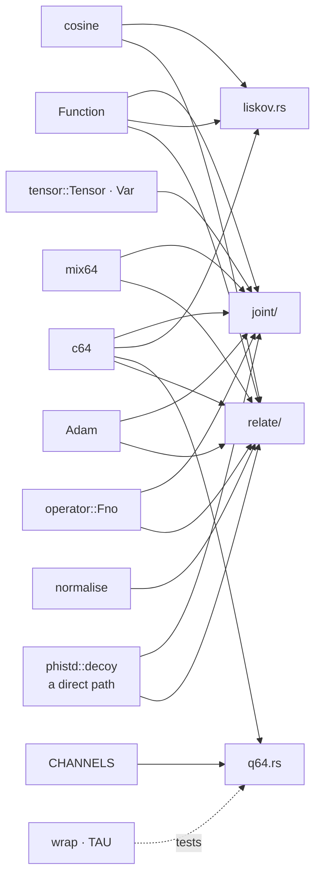
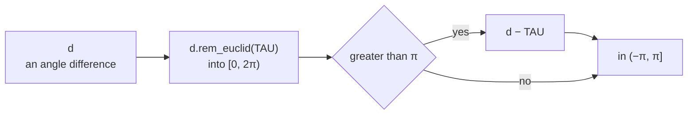

# lib

## Inside lib.rs

```mermaid
graph LR
    lib["lib.rs"]
    subgraph mods["pub mod"]
        m2["joint"]
        m3["liskov"]
        m4["q64"]
        m5["relate"]
    end
    subgraph own["its own items"]
        ch["CHANNELS = 64<br/>relation channels · the Q64 alphabet"]
        tau["TAU = 2π"]
        wr["wrap(d)<br/>phistd's, re-exported"]
    end
    subgraph reex["pub use"]
        fno["from phifno<br/>heat · operator"]
        op["from operator<br/>rank · zeta_weights · Example · Fno · FnoConfig<br/>FrequencySampler · MixtureExample · Module · Sequential · Tie"]
        jt["from joint<br/>IndexExample · Joint"]
        std1["from phistd<br/>cosine · mix64 · normalise · stack · unstack · unit_phase · unit_random<br/>Adam · AdamState · Function · MixtureTerms · Tape · Tensor · Var"]
        std2["from phistd<br/>phasor · tensor"]
        cx["from num_complex<br/>Complex64 as c64"]
    end
    lib --> mods
    lib --> own
    lib --> reex
```

## One path, two homes

```mermaid
flowchart LR
    p1["phical::operator"] --> h1["phifno::operator"]
    p2["phical::heat"] --> h2["phifno::heat"]
    p3["phical::Fno · FnoConfig · Tie · rank · …"] --> h1
    p4["phical::Tensor · Tape · Adam · cosine · …"] --> h3["phistd"]
    p5["phical::tensor · phical::phasor"] --> h3
    p6["phical::c64"] --> h4["num_complex::Complex64"]
    p7["phical::Joint · IndexExample"] --> h5["phical::joint"]
```

## Who reads what — crate:: paths inside phical

```mermaid
graph LR
    c64["c64"]
    mix["mix64"]
    cos["cosine"]
    nor["normalise"]
    fun["Function"]
    adam["Adam"]
    ten["tensor::Tensor · Var"]
    fno["operator::Fno"]
    dec["phistd::decoy<br/>a direct path"]
    ch["CHANNELS"]
    wr["wrap · TAU"]
    joint["joint/"]
    lis["liskov.rs"]
    q64["q64.rs"]
    rel["relate/"]
    c64 --> joint & lis & q64 & rel
    mix --> joint & rel
    cos --> lis & rel
    nor --> rel
    fun --> joint & lis & rel
    adam --> joint & rel
    ten --> joint
    fno --> joint & rel
    dec --> joint & rel
    ch --> q64
    wr -.->|"tests"| q64
```

## wrap

```mermaid
flowchart LR
    d["d<br/>an angle difference"] --> r["d.rem_euclid(TAU)<br/>into [0, 2π)"] --> c{"greater than π"}
    c -->|"yes"| s["d − TAU"] --> out["in (−π, π]"]
    c -->|"no"| out
```
