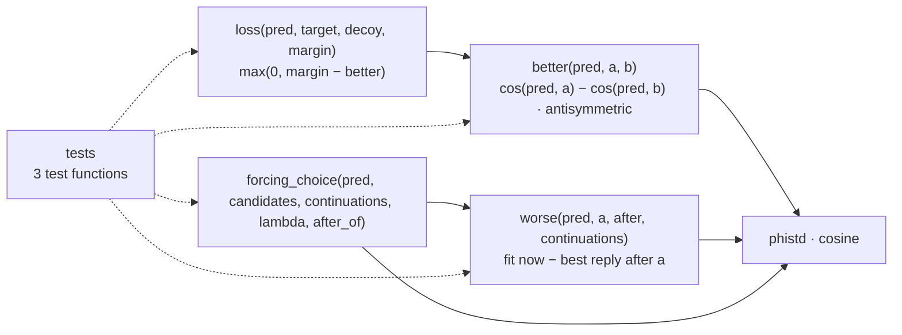
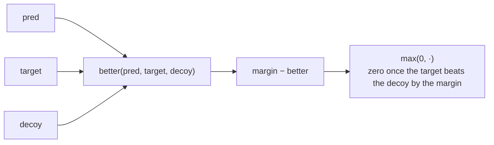
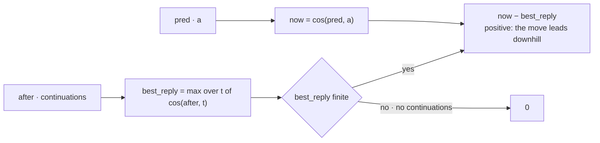
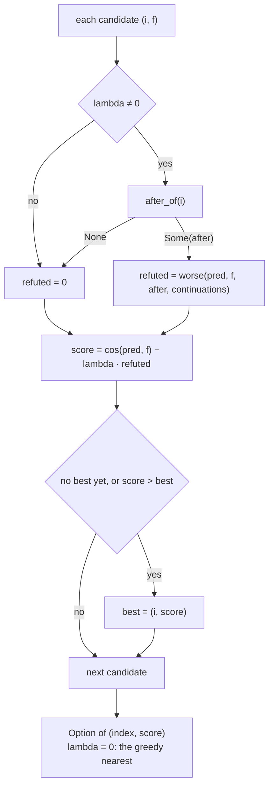
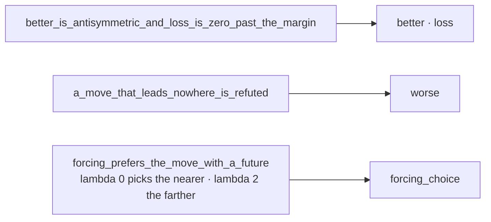

# liskov

## Inside liskov.rs

```mermaid
graph LR
    better["better(pred, a, b)<br/>cos(pred, a) − cos(pred, b) · antisymmetric"]
    worse["worse(pred, a, after, continuations)<br/>fit now − best reply after a"]
    loss["loss(pred, target, decoy, margin)<br/>max(0, margin − better)"]
    fc["forcing_choice(pred, candidates, continuations, lambda, after_of)"]
    tests["tests<br/>3 test functions"]
    cos["phistd · cosine"]
    loss --> better --> cos
    fc --> worse --> cos
    fc --> cos
    tests -.-> better & worse & loss & fc
```

## better and loss — the hinge

```mermaid
flowchart LR
    pr["pred"] --> b["better(pred, target, decoy)"]
    t["target"] --> b
    d["decoy"] --> b
    b --> m["margin − better"] --> h["max(0, ·)<br/>zero once the target beats the decoy by the margin"]
```

## worse — the refutation

```mermaid
flowchart LR
    p["pred · a"] --> now["now = cos(pred, a)"]
    af["after · continuations"] --> br["best_reply = max over t of cos(after, t)"]
    br --> fin{"best_reply finite"}
    fin -->|"yes"| dd["now − best_reply<br/>positive: the move leads downhill"]
    fin -->|"no · no continuations"| zero["0"]
    now --> dd
```

## forcing_choice

```mermaid
flowchart TD
    c["each candidate (i, f)"] --> l{"lambda ≠ 0"}
    l -->|"no"| r0["refuted = 0"]
    l -->|"yes"| a["after_of(i)"]
    a -->|"Some(after)"| w["refuted = worse(pred, f, after, continuations)"]
    a -->|"None"| r0
    r0 --> s["score = cos(pred, f) − lambda · refuted"]
    w --> s
    s --> b{"no best yet, or score #gt; best"}
    b -->|"yes"| keep["best = (i, score)"]
    b -->|"no"| nxt["next candidate"]
    keep --> nxt
    nxt --> out["Option of (index, score)<br/>lambda = 0: the greedy nearest"]
```

## The three tests

```mermaid
graph LR
    t1["better_is_antisymmetric_and_loss_is_zero_past_the_margin"] --> better2["better · loss"]
    t2["a_move_that_leads_nowhere_is_refuted"] --> worse2["worse"]
    t3["forcing_prefers_the_move_with_a_future<br/>lambda 0 picks the nearer · lambda 2 the farther"] --> fc2["forcing_choice"]
```
