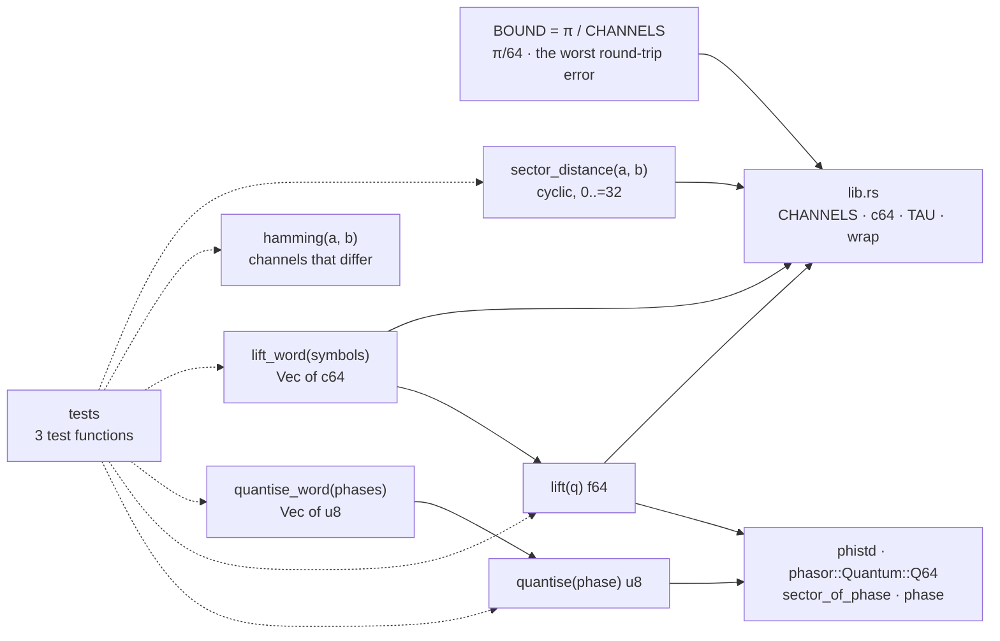
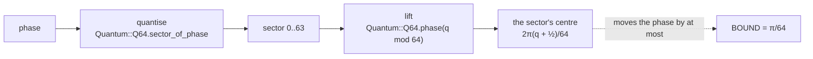
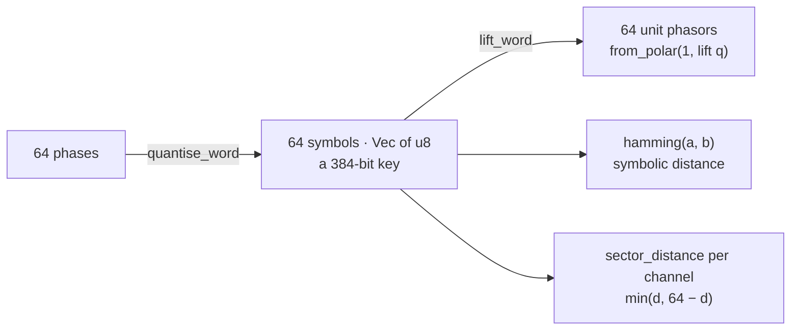
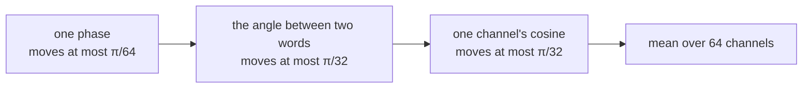
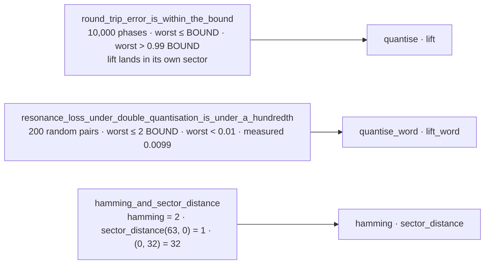

# q64

## Inside q64.rs

```mermaid
graph LR
    bound["BOUND = π / CHANNELS<br/>π/64 · the worst round-trip error"]
    quantise["quantise(phase) u8"]
    lift["lift(q) f64"]
    qw["quantise_word(phases)<br/>Vec of u8"]
    lw["lift_word(symbols)<br/>Vec of c64"]
    ham["hamming(a, b)<br/>channels that differ"]
    sd["sector_distance(a, b)<br/>cyclic, 0..=32"]
    quantum["phistd · phasor::Quantum::Q64<br/>sector_of_phase · phase"]
    lib["lib.rs<br/>CHANNELS · c64 · TAU · wrap"]
    tests["tests<br/>3 test functions"]
    quantise --> quantum
    lift --> quantum
    qw --> quantise
    lw --> lift
    bound & sd & lift & lw --> lib
    tests -.-> quantise & lift & qw & lw & ham & sd
```

## The round trip

```mermaid
flowchart LR
    ph["phase"] --> q["quantise<br/>Quantum::Q64.sector_of_phase"] --> s["sector 0..63"]
    s --> l["lift<br/>Quantum::Q64.phase(q mod 64)"] --> c["the sector's centre<br/>2π(q + ½)/64"]
    c -.->|"moves the phase by at most"| b["BOUND = π/64"]
```

## A word of 64 channels

```mermaid
flowchart LR
    phs["64 phases"] -->|"quantise_word"| sym["64 symbols · Vec of u8<br/>a 384-bit key"]
    sym -->|"lift_word"| zs["64 unit phasors<br/>from_polar(1, lift q)"]
    sym --> h["hamming(a, b)<br/>symbolic distance"]
    sym --> d["sector_distance per channel<br/>min(d, 64 − d)"]
```

## A pair, both quantised — the doc's bounds

```mermaid
flowchart LR
    one["one phase<br/>moves at most π/64"] --> two["the angle between two words<br/>moves at most π/32"]
    two --> ch["one channel's cosine<br/>moves at most π/32"]
    ch --> mean["mean over 64 channels"]
```

## The three tests

```mermaid
graph LR
    t1["round_trip_error_is_within_the_bound<br/>10,000 phases · worst ≤ BOUND · worst #gt; 0.99 BOUND<br/>lift lands in its own sector"]
    t2["resonance_loss_under_double_quantisation_is_under_a_hundredth<br/>200 random pairs · worst ≤ 2 BOUND · worst #lt; 0.01 · measured 0.0099"]
    t3["hamming_and_sector_distance<br/>hamming = 2 · sector_distance(63, 0) = 1 · (0, 32) = 32"]
    t1 --> q["quantise · lift"]
    t2 --> w["quantise_word · lift_word"]
    t3 --> hs["hamming · sector_distance"]
```
