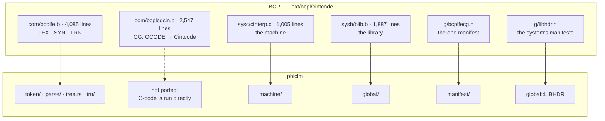
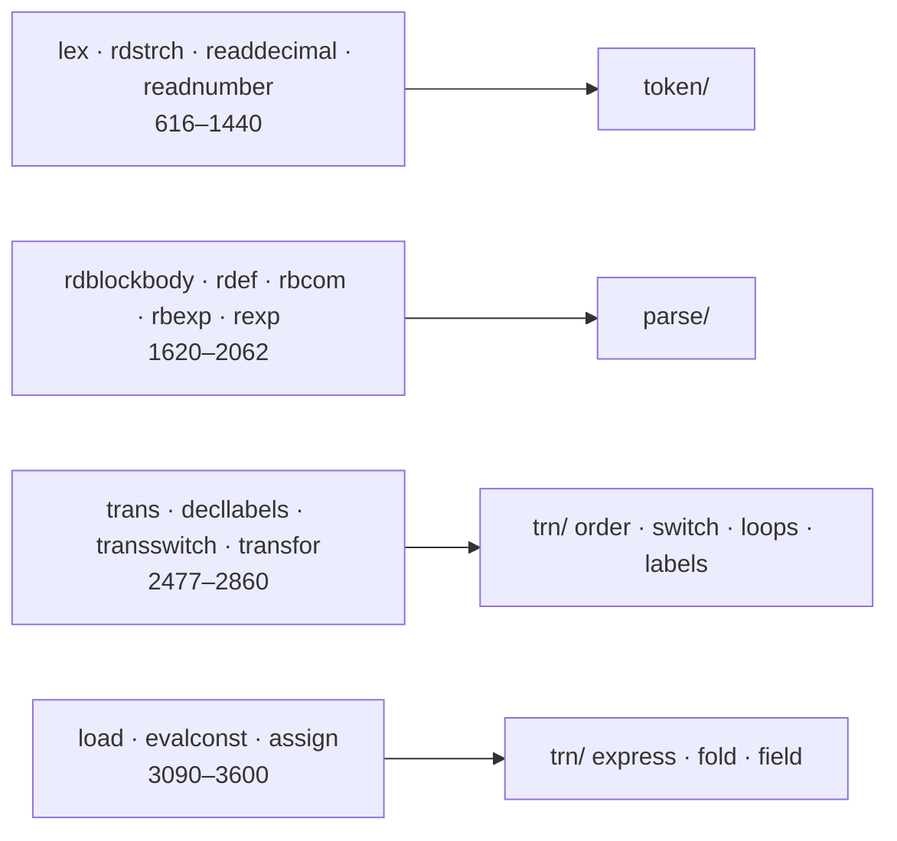
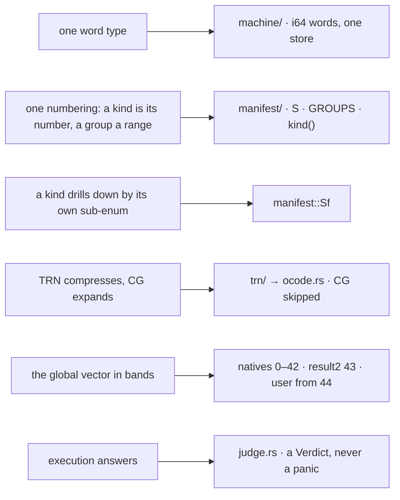
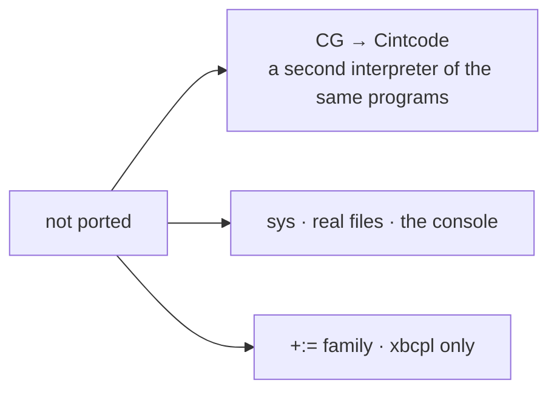

# BCPL, file for file

## The map

```mermaid
graph TB
    subgraph BCPL["BCPL — ext/bcpl/cintcode"]
        B1["com/bcplfe.b · 4,085 lines<br/>LEX · SYN · TRN"]
        B2["com/bcplcgcin.b · 2,547 lines<br/>CG: OCODE → Cintcode"]
        B3["sysc/cinterp.c · 1,005 lines<br/>the machine"]
        B4["sysb/blib.b · 1,887 lines<br/>the library"]
        B5["g/bcplfecg.h<br/>the one manifest"]
        B6["g/libhdr.h<br/>the system's manifests"]
    end
    subgraph ours["phiclm"]
        P1["token/ · parse/ · tree.rs · trn/"]
        P2["not ported:<br/>O-code is run directly"]
        P3["machine/"]
        P4["global/"]
        P5["manifest/"]
        P6["global::LIBHDR"]
    end
    B1 --> P1
    B2 -.-> P2
    B3 --> P3
    B4 --> P4
    B5 --> P5
    B6 --> P6
```

## bcplfe.b, routine by routine

```mermaid
graph LR
    lex["lex · rdstrch · readdecimal · readnumber<br/>616–1440"] --> T["token/"]
    syn["rdblockbody · rdef · rbcom · rbexp · rexp<br/>1620–2062"] --> P["parse/"]
    trans["trans · decllabels · transswitch · transfor<br/>2477–2860"] --> TR["trn/ order · switch · loops · labels"]
    load["load · evalconst · assign<br/>3090–3600"] --> TE["trn/ express · fold · field"]
```

## BCPL's ideas, and ours

```mermaid
graph LR
    I1["one word type"] --> O1["machine/ · i64 words, one store"]
    I2["one numbering: a kind is its number, a group a range"] --> O2["manifest/ · S · GROUPS · kind()"]
    I3["a kind drills down by its own sub-enum"] --> O3["manifest::Sf"]
    I4["TRN compresses, CG expands"] --> O4["trn/ → ocode.rs · CG skipped"]
    I5["the global vector in bands"] --> O5["natives 0–42 · result2 43 · user from 44"]
    I6["execution answers"] --> O6["judge.rs · a Verdict, never a panic"]
```

## What is not ported

```mermaid
graph LR
    NP["not ported"] --> CG["CG → Cintcode<br/>a second interpreter of the same programs"]
    NP --> ST["sys · real files · the console"]
    NP --> AO["+:= family · xbcpl only"]
```
