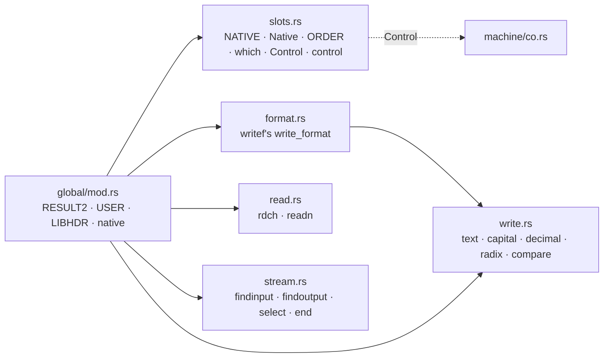
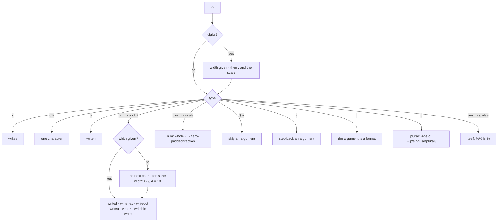
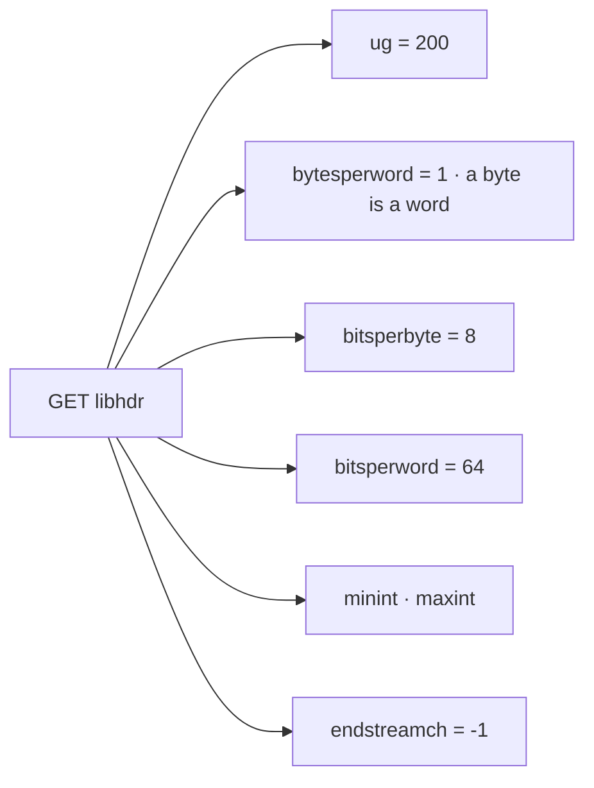
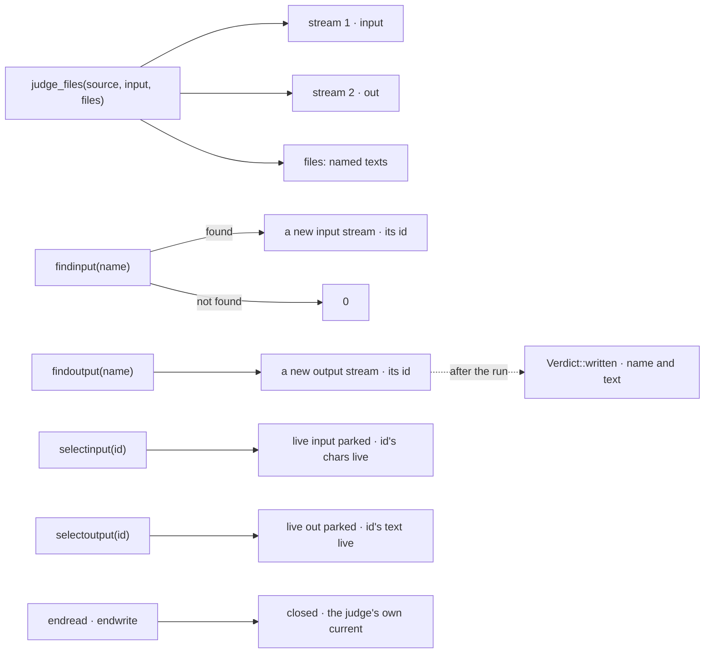

# global

## Files

```mermaid
graph LR
    mod["global/mod.rs<br/>RESULT2 · USER · LIBHDR · native"]
    slots["slots.rs<br/>NATIVE · Native · ORDER · which · Control · control"]
    format["format.rs<br/>writef's write_format"]
    write["write.rs<br/>text · capital · decimal · radix · compare"]
    read["read.rs<br/>rdch · readn"]
    stream["stream.rs<br/>findinput · findoutput · select · end"]
    mod --> slots
    mod --> format --> write
    mod --> write & read & stream
    slots -.->|"Control"| machine["machine/co.rs"]
```

## The slots

```mermaid
graph TD
    subgraph write_["writing"]
        s0["0 writef"] --- s1["1 writes"] --- s2["2 newline"] --- s3["3 writen"] --- s4["4 wrch"]
        s5["5 writed"] --- s6["6 writez"] --- s7["7 writeu"] --- s8["8 writehex"] --- s9["9 writeoct"] --- s10["10 writebin"]
        s16["16 writet"] --- s17["17 codewrch"]
    end
    subgraph chars["characters and strings"]
        s11["11 capitalch"] --- s12["12 compch"] --- s13["13 compstring"]
        s24["24 packstring"] --- s25["25 unpackstring"]
    end
    subgraph store["store"]
        s14["14 getvec"] --- s15["15 freevec"]
    end
    subgraph input["input"]
        s18["18 rdch"] --- s19["19 unrdch"] --- s20["20 readn"]
    end
    subgraph arith["arithmetic"]
        s21["21 randno"] --- s22["22 setseed"] --- s23["23 muldiv"]
    end
    subgraph control_["control: the run loop does these"]
        s26["26 createco"] --- s27["27 deleteco"] --- s28["28 callco"] --- s29["29 resumeco"] --- s30["30 cowait"]
        s31["31 level"] --- s32["32 longjump"] --- s33["33 stop"] --- s34["34 abort"]
    end
    subgraph streams_["streams"]
        s35["35 findinput"] --- s36["36 findoutput"] --- s37["37 selectinput"] --- s38["38 selectoutput"]
        s39["39 endread"] --- s40["40 endwrite"] --- s41["41 input"] --- s42["42 output"]
    end
    r2["43 result2 · muldiv's remainder · readn's success"]
```

## writef — one item

```mermaid
flowchart TD
    P["%"] --> W{"digits?"}
    W -->|"yes"| WID["width given · then . and the scale"]
    W -->|"no"| T
    WID --> T{"type"}
    T -->|"s"| S["writes"]
    T -->|"c  #"| C["one character"]
    T -->|"n"| N["writen"]
    T -->|"i d x o u z b t"| GW{"width given?"}
    GW -->|"no"| CH["the next character is the width: 0-9, A = 10"]
    GW -->|"yes"| DO
    CH --> DO["writed · writehex · writeoct · writeu · writez · writebin · writet"]
    T -->|"d with a scale"| SC["n.m: whole · . · zero-padded fraction"]
    T -->|"$ +"| SKIP["skip an argument"]
    T -->|"-"| BACK["step back an argument"]
    T -->|"f"| NEST["the argument is a format"]
    T -->|"p"| PL["plural: %ps or %p\singular\plural\"]
    T -->|"anything else"| SELF["itself: %% is %"]
```

## libhdr — what GET "libhdr" declares

```mermaid
graph LR
    H["GET libhdr"] --> ug["ug = 200"]
    H --> bpw["bytesperword = 1 · a byte is a word"]
    H --> bpb["bitsperbyte = 8"]
    H --> bw["bitsperword = 64"]
    H --> mm["minint · maxint"]
    H --> eos["endstreamch = -1"]
```

## Streams — the current two are live, the rest parked

```mermaid
flowchart LR
    J["judge_files(source, input, files)"] --> S1["stream 1 · input"]
    J --> S2["stream 2 · out"]
    J --> FS["files: named texts"]
    FI["findinput(name)"] -->|"found"| NI["a new input stream · its id"]
    FI -->|"not found"| Z["0"]
    FO["findoutput(name)"] --> NO["a new output stream · its id"]
    SI["selectinput(id)"] --> PI["live input parked · id's chars live"]
    SO["selectoutput(id)"] --> PO["live out parked · id's text live"]
    ER["endread · endwrite"] --> CL["closed · the judge's own current"]
    NO -.->|"after the run"| W["Verdict::written · name and text"]
```
