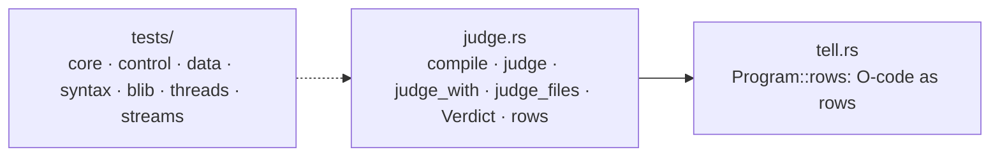
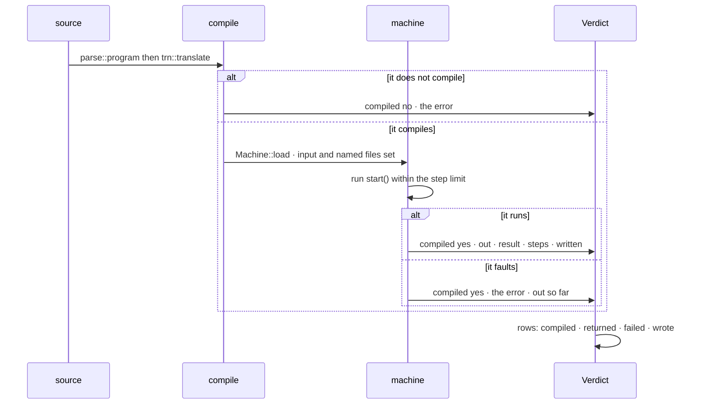
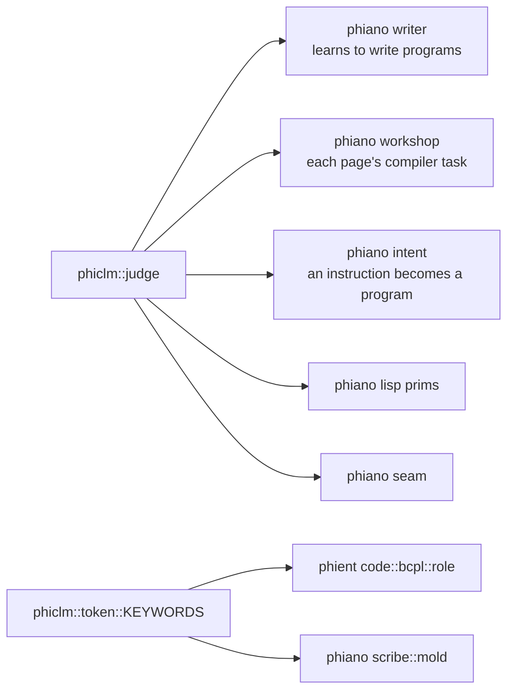
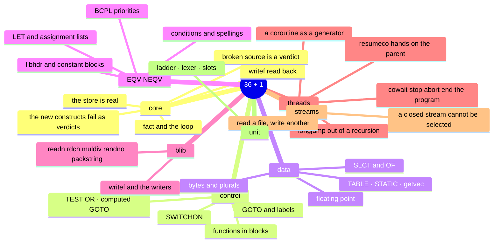

# judge · tell · tests

## Files

```mermaid
graph LR
    judge["judge.rs<br/>compile · judge · judge_with · judge_files · Verdict · rows"]
    tell["tell.rs<br/>Program::rows: O-code as rows"]
    tests["tests/<br/>core · control · data · syntax · blib · threads · streams"]
    judge --> tell
    tests -.-> judge
```

## One judgement

```mermaid
sequenceDiagram
    participant S as source
    participant C as compile
    participant M as machine
    participant V as Verdict
    S->>C: parse::program then trn::translate
    alt it does not compile
        C->>V: compiled no · the error
    else it compiles
        C->>M: Machine::load · input and named files set
        M->>M: run start() within the step limit
        alt it runs
            M->>V: compiled yes · out · result · steps · written
        else it faults
            M->>V: compiled yes · the error · out so far
        end
    end
    V->>V: rows: compiled · returned · failed · wrote
```

## Who leans on it

```mermaid
graph LR
    J["phiclm::judge"] --> W["phiano writer<br/>learns to write programs"]
    J --> WS["phiano workshop<br/>each page's compiler task"]
    J --> IN["phiano intent<br/>an instruction becomes a program"]
    J --> L["phiano lisp prims"]
    J --> SE["phiano seam"]
    K["phiclm::token::KEYWORDS"] --> R["phient code::bcpl::role"]
    K --> MO["phiano scribe::mold"]
```

## The tests

```mermaid
mindmap
  root((36 + 1))
    core
      fact and the loop
      the store is real
      writef read back
      broken source is a verdict
      the new constructs fail as verdicts
    control
      SWITCHON
      GOTO and labels
      TEST OR · computed GOTO
      functions in blocks
    data
      bytes and plurals
      TABLE · STATIC · getvec
      SLCT and OF
      floating point
    syntax
      EQV NEQV
      BCPL priorities
      LET and assignment lists
      libhdr and constant blocks
      conditions and spellings
    blib
      writef and the writers
      readn rdch muldiv randno packstring
    threads
      a coroutine as a generator
      resumeco hands on the parent
      cowait stop abort end the program
      longjump out of a recursion
    streams
      read a file, write another
      a closed stream cannot be selected
    unit
      ladder · lexer · slots
```
