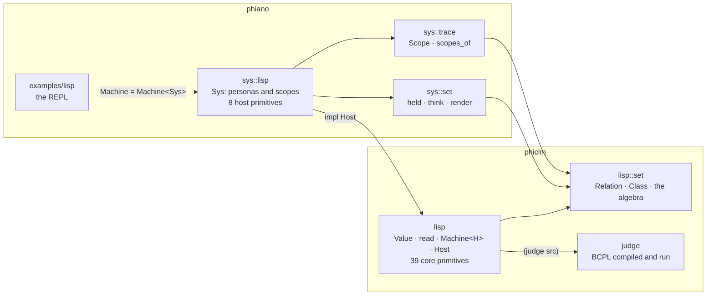
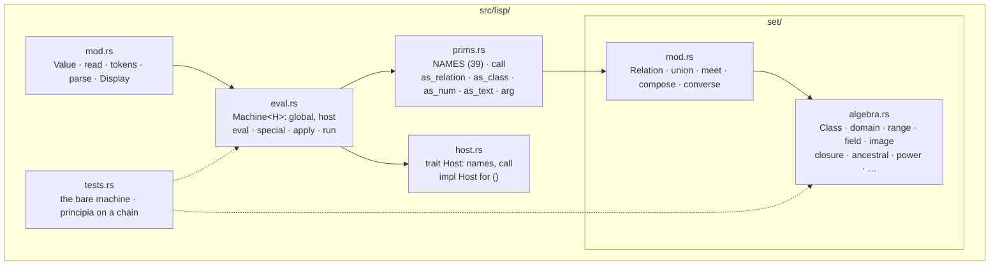
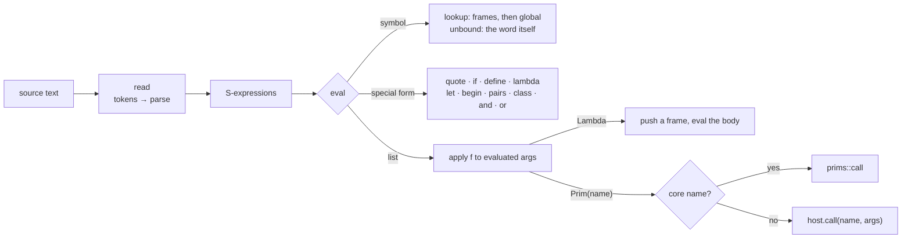
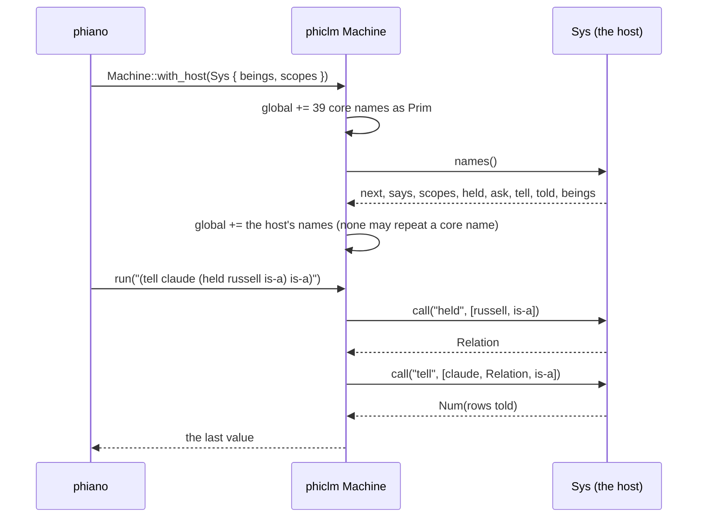

# phiclm · lisp — architecture

## Where it sits

```mermaid
graph LR
    subgraph phiclm_["phiclm"]
        lisp["lisp<br/>Value · read · Machine&lt;H&gt; · Host<br/>39 core primitives"]
        set_["lisp::set<br/>Relation · Class · the algebra"]
        judge["judge<br/>BCPL compiled and run"]
    end
    subgraph phiano_["phiano"]
        host["sys::lisp<br/>Sys: personas and scopes<br/>8 host primitives"]
        sysset["sys::set<br/>held · think · render"]
        trace["sys::trace<br/>Scope · scopes_of"]
        example["examples/lisp<br/>the REPL"]
    end
    lisp --> set_
    lisp -->|"(judge src)"| judge
    host -->|"impl Host"| lisp
    host --> sysset
    host --> trace
    sysset --> set_
    trace --> set_
    example -->|"Machine = Machine&lt;Sys&gt;"| host
```

## Inside phiclm::lisp

```mermaid
graph TD
    subgraph lispmod["src/lisp/"]
        mod_["mod.rs<br/>Value · read · tokens · parse · Display"]
        eval["eval.rs<br/>Machine&lt;H&gt;: global, host<br/>eval · special · apply · run"]
        prims["prims.rs<br/>NAMES (39) · call<br/>as_relation · as_class · as_num · as_text · arg"]
        host_["host.rs<br/>trait Host: names, call<br/>impl Host for ()"]
        subgraph setdir["set/"]
            setmod["mod.rs<br/>Relation · union · meet · compose · converse"]
            algebra["algebra.rs<br/>Class · domain · range · field · image<br/>closure · ancestral · power · …"]
        end
        tests["tests.rs<br/>the bare machine · principia on a chain"]
    end
    mod_ --> eval
    eval --> prims
    eval --> host_
    prims --> setmod
    setmod --> algebra
    tests -.-> eval
    tests -.-> algebra
```

## A form, evaluated

```mermaid
flowchart LR
    src["source text"] --> read["read<br/>tokens → parse"]
    read --> forms["S-expressions"]
    forms --> eval{"eval"}
    eval -->|"symbol"| look["lookup: frames, then global<br/>unbound: the word itself"]
    eval -->|"special form"| spec["quote · if · define · lambda<br/>let · begin · pairs · class · and · or"]
    eval -->|"list"| apply["apply f to evaluated args"]
    apply -->|"Lambda"| frame["push a frame, eval the body"]
    apply -->|"Prim(name)"| which{"core name?"}
    which -->|"yes"| core["prims::call"]
    which -->|"no"| hostcall["host.call(name, args)"]
```

## The host seam

```mermaid
sequenceDiagram
    participant P as phiano
    participant M as phiclm Machine
    participant H as Sys (the host)
    P->>M: Machine::with_host(Sys { beings, scopes })
    M->>M: global += 39 core names as Prim
    M->>H: names()
    H-->>M: next, says, scopes, held, ask, tell, told, beings
    M->>M: global += the host's names (none may repeat a core name)
    P->>M: run("(tell claude (held russell is-a) is-a)")
    M->>H: call("held", [russell, is-a])
    H-->>M: Relation
    M->>H: call("tell", [claude, Relation, is-a])
    H-->>M: Num(rows told)
    M-->>P: the last value
```
