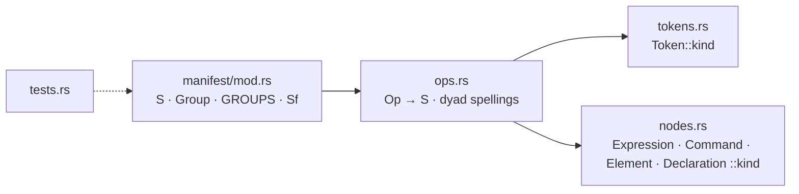
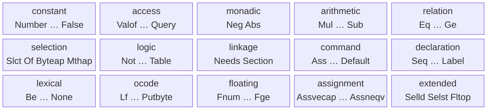
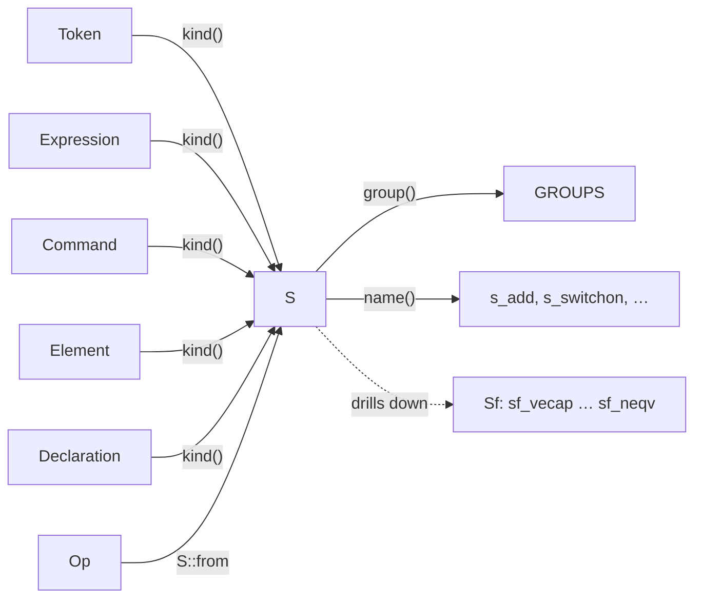
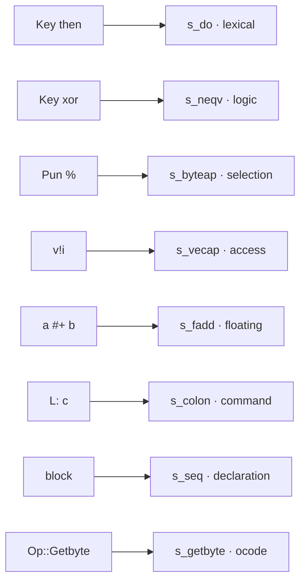

# manifest

## Files

```mermaid
graph LR
    mod["manifest/mod.rs<br/>S · Group · GROUPS · Sf"]
    ops["ops.rs<br/>Op → S · dyad spellings"]
    tokens["tokens.rs<br/>Token::kind"]
    nodes["nodes.rs<br/>Expression · Command · Element · Declaration ::kind"]
    tests["tests.rs"]
    mod --> ops --> tokens & nodes
    tests -.-> mod
```

## The groups — contiguous ranges, in the header's order

```mermaid
block-beta
    columns 5
    constant["constant<br/>Number … False"] access["access<br/>Valof … Query"] monadic["monadic<br/>Neg Abs"] arithmetic["arithmetic<br/>Mul … Sub"] relation["relation<br/>Eq … Ge"]
    selection["selection<br/>Slct Of Byteap Mthap"] logic["logic<br/>Not … Table"] linkage["linkage<br/>Needs Section"] command["command<br/>Ass … Default"] declaration["declaration<br/>Seq … Label"]
    lexical["lexical<br/>Be … None"] ocode["ocode<br/>Lf … Putbyte"] floating["floating<br/>Fnum … Fge"] assignment["assignment<br/>Assvecap … Assneqv"] extended["extended<br/>Selld Selst Fltop"]
```

## Every enum climbs it

```mermaid
graph LR
    Token -->|"kind()"| S
    Expression -->|"kind()"| S
    Command -->|"kind()"| S
    Element -->|"kind()"| S
    Declaration -->|"kind()"| S
    Op -->|"S::from"| S
    S -->|"group()"| G["GROUPS"]
    S -->|"name()"| N["s_add, s_switchon, …"]
    S -.drills down.-> Sf["Sf: sf_vecap … sf_neqv"]
```

## Examples

```mermaid
graph LR
    t1["Key then"] --> do["s_do · lexical"]
    t2["Key xor"] --> neqv["s_neqv · logic"]
    t3["Pun %"] --> byteap["s_byteap · selection"]
    e1["v!i"] --> vecap["s_vecap · access"]
    e2["a #+ b"] --> fadd["s_fadd · floating"]
    c1["L: c"] --> colon["s_colon · command"]
    c2["block"] --> seq["s_seq · declaration"]
    o1["Op::Getbyte"] --> gb["s_getbyte · ocode"]
```
