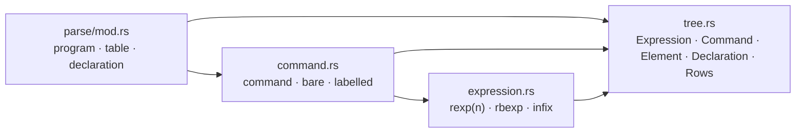
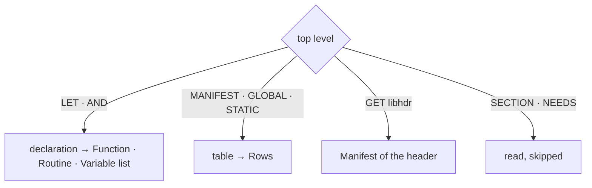
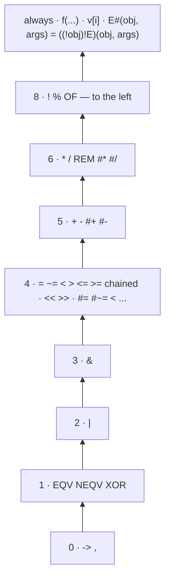
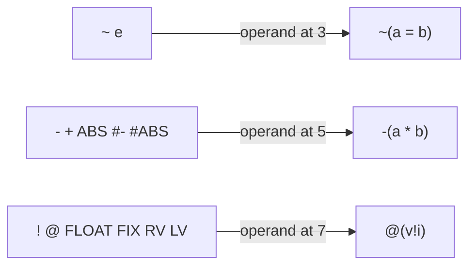
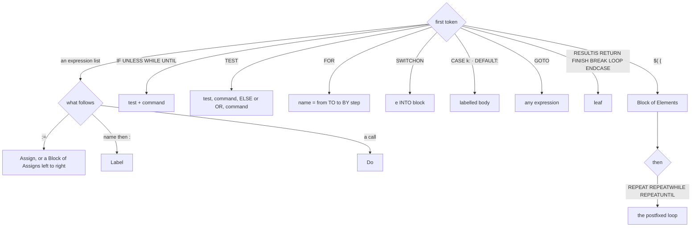
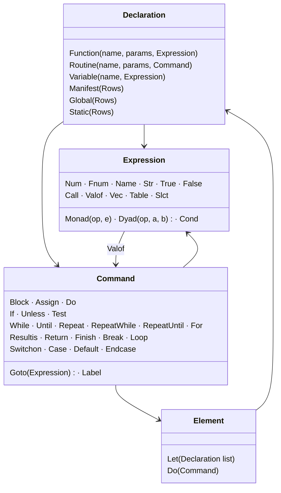

# parse · tree

## Files

```mermaid
graph LR
    mod["parse/mod.rs<br/>program · table · declaration"]
    cmd["command.rs<br/>command · bare · labelled"]
    exp["expression.rs<br/>rexp(n) · rbexp · infix"]
    tree["tree.rs<br/>Expression · Command · Element · Declaration · Rows"]
    mod --> cmd --> exp
    mod & cmd & exp --> tree
```

## A program

```mermaid
flowchart TD
    P{"top level"} -->|"LET · AND"| D["declaration → Function · Routine · Variable list"]
    P -->|"MANIFEST · GLOBAL · STATIC"| T["table → Rows"]
    P -->|"GET libhdr"| H["Manifest of the header"]
    P -->|"SECTION · NEEDS"| X["read, skipped"]
```

## The priorities — `rexp(n)` climbs only past `n`

```mermaid
graph BT
    L0["0 · -#gt; ,"] --> L1["1 · EQV NEQV XOR"] --> L2["2 · |"] --> L3["3 · &"] --> L4["4 · = ~= #lt; #gt; #lt;= #gt;= chained · #lt;#lt; #gt;#gt; · #= #~= #lt; ..."]
    L4 --> L5["5 · + - #+ #-"] --> L6["6 · * / REM #* #/"] --> L8["8 · ! % OF  — to the left"]
    L8 --> ALL["always · f(...) · v[i] · E#(obj, args) = ((!obj)!E)(obj, args)"]
```

```mermaid
graph LR
    M1["~ e"] -->|"operand at 3"| R3["~(a = b)"]
    M2["- + ABS #- #ABS"] -->|"operand at 5"| R5["-(a * b)"]
    M3["! @ FLOAT FIX RV LV"] -->|"operand at 7"| R7["@(v!i)"]
```

## A command

```mermaid
flowchart TD
    C{"first token"}
    C -->|"$( {"| B["Block of Elements"]
    C -->|"IF UNLESS WHILE UNTIL"| Q["test + command"]
    C -->|"TEST"| TE["test, command, ELSE or OR, command"]
    C -->|"FOR"| F["name = from TO to BY step"]
    C -->|"SWITCHON"| SW["e INTO block"]
    C -->|"CASE k: · DEFAULT:"| LB["labelled body"]
    C -->|"GOTO"| G["any expression"]
    C -->|"RESULTIS RETURN FINISH BREAK LOOP ENDCASE"| K["leaf"]
    C -->|"an expression list"| E{"what follows"}
    E -->|":="| A["Assign, or a Block of Assigns left to right"]
    E -->|"name then :"| LAB["Label"]
    E -->|"a call"| DO["Do"]
    B --> PF{"then"}
    PF -->|"REPEAT REPEATWHILE REPEATUNTIL"| RP["the postfixed loop"]
```

## The tree

```mermaid
classDiagram
    class Declaration {
        Function(name, params, Expression)
        Routine(name, params, Command)
        Variable(name, Expression)
        Manifest(Rows)
        Global(Rows)
        Static(Rows)
    }
    class Element {
        Let(Declaration list)
        Do(Command)
    }
    class Command {
        Block · Assign · Do
        If · Unless · Test
        While · Until · Repeat · RepeatWhile · RepeatUntil · For
        Resultis · Return · Finish · Break · Loop
        Switchon · Case · Default · Endcase
        Goto(Expression) · Label
    }
    class Expression {
        Num · Fnum · Name · Str · True · False
        Monad(op, e) · Dyad(op, a, b) · Cond
        Call · Valof · Vec · Table · Slct
    }
    Declaration --> Expression
    Declaration --> Command
    Command --> Element
    Element --> Declaration
    Command --> Expression
    Expression --> Command : Valof
```
