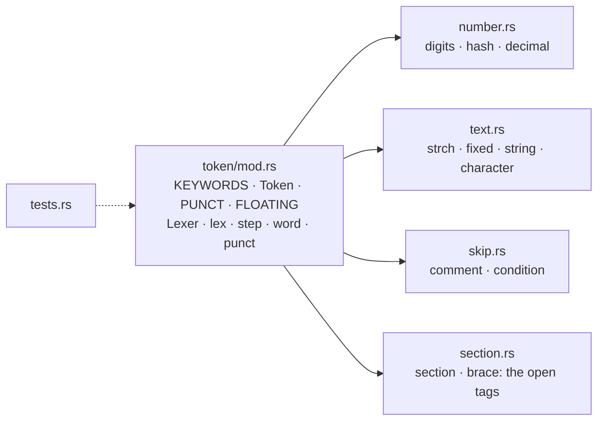
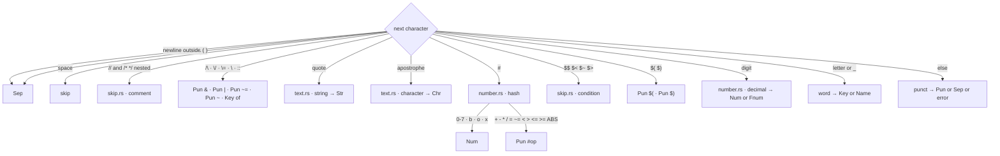
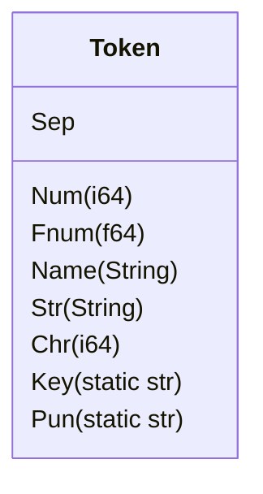
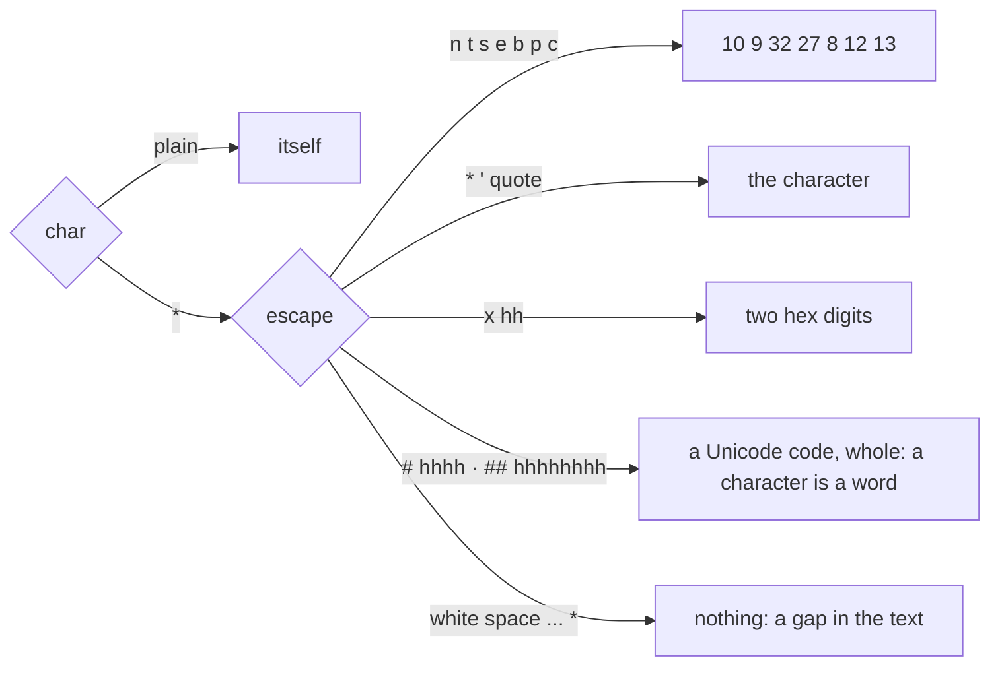
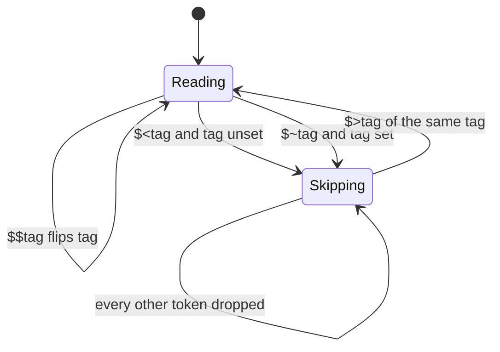

# token

## Files

```mermaid
graph LR
    mod["token/mod.rs<br/>KEYWORDS · Token · PUNCT · FLOATING<br/>Lexer · lex · step · word · punct"]
    number["number.rs<br/>digits · hash · decimal"]
    text["text.rs<br/>strch · fixed · string · character"]
    skip["skip.rs<br/>comment · condition"]
    section["section.rs<br/>section · brace: the open tags"]
    tests["tests.rs"]
    mod --> number & text & skip & section
    tests -.-> mod
```

## One step: a character decides

```mermaid
flowchart TD
    C{"next character"}
    C -->|"newline outside ( )"| SEP["Sep"]
    C -->|"space"| SKIP0["skip"]
    C -->|"// and /* */ nested"| COM["skip.rs · comment"]
    C -->|"/\ · \/ · \= · \ · ::"| SP["Pun & · Pun | · Pun ~= · Pun ~ · Key of"]
    C -->|"."| SEP
    C -->|"quote"| STR["text.rs · string → Str"]
    C -->|"apostrophe"| CHR["text.rs · character → Chr"]
    C -->|"#"| HASH["number.rs · hash"]
    C -->|"$$ $#lt; $~ $#gt;"| COND["skip.rs · condition"]
    C -->|"$( $)"| SEC["Pun $( · Pun $)"]
    C -->|"digit"| DEC["number.rs · decimal → Num or Fnum"]
    C -->|"letter or _"| WORD["word → Key or Name"]
    C -->|"else"| PUN["punct → Pun or Sep or error"]
    HASH -->|"0-7 · b · o · x"| NUM["Num"]
    HASH -->|"+ - * / = ~= #lt; #gt; #lt;= #gt;= ABS"| FOP["Pun #op"]
```

## A token

```mermaid
classDiagram
    class Token {
        Num(i64)
        Fnum(f64)
        Name(String)
        Str(String)
        Chr(i64)
        Key(static str)
        Pun(static str)
        Sep
    }
```

## A string's characters — `rdstrch`

```mermaid
flowchart LR
    S{"char"} -->|"plain"| K["itself"]
    S -->|"*"| E{"escape"}
    E -->|"n t s e b p c"| CTRL["10 9 32 27 8 12 13"]
    E -->|"* ' quote"| SELF["the character"]
    E -->|"x hh"| HEX["two hex digits"]
    E -->|"# hhhh · ## hhhhhhhh"| UNI["a Unicode code, whole: a character is a word"]
    E -->|"white space ... *"| GAP["nothing: a gap in the text"]
```

## Conditional sections

```mermaid
stateDiagram-v2
    [*] --> Reading
    Reading --> Reading: $$tag flips tag
    Reading --> Skipping: $#lt;tag and tag unset
    Reading --> Skipping: $~tag and tag set
    Skipping --> Reading: $#gt;tag of the same tag
    Skipping --> Skipping: every other token dropped
```
