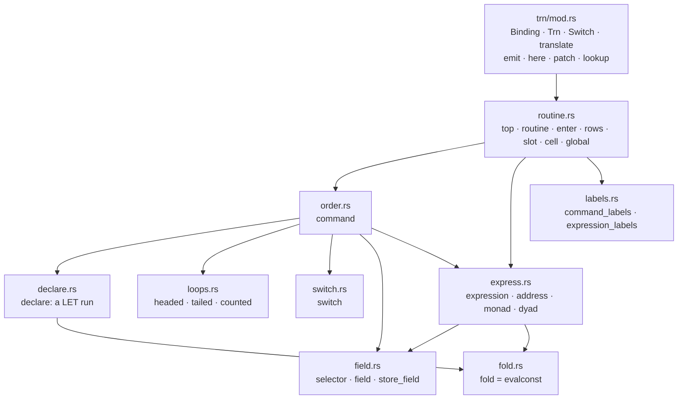
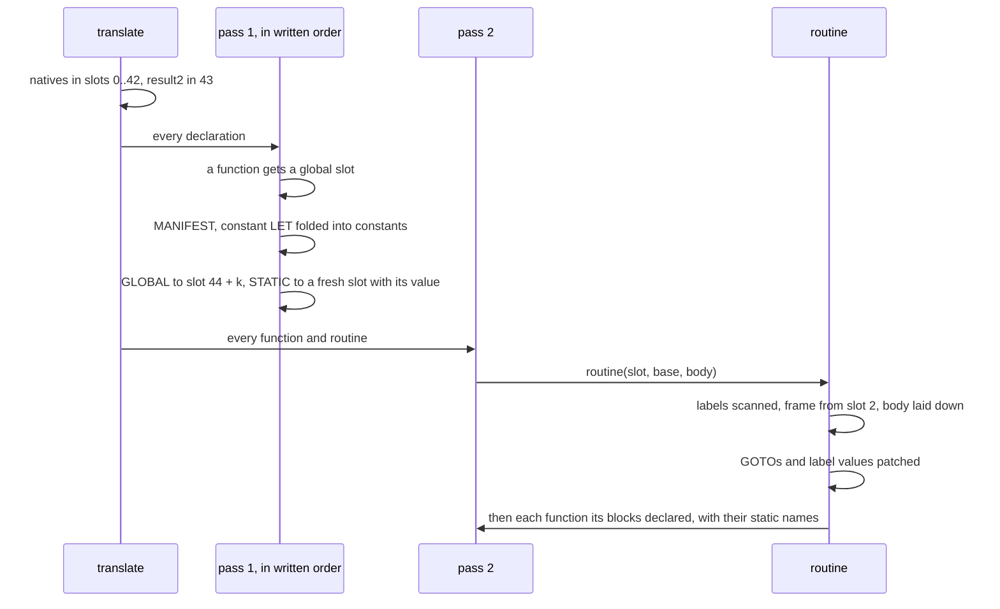
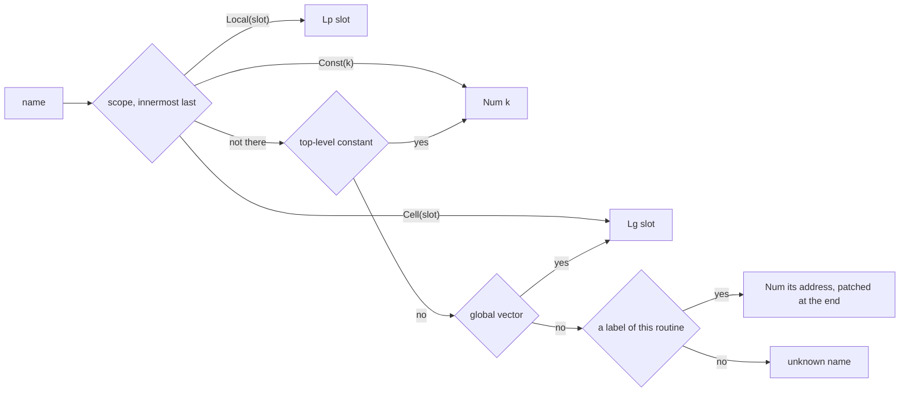
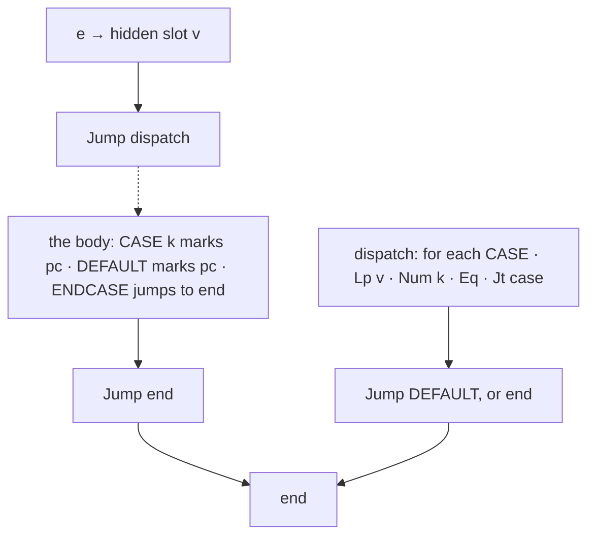
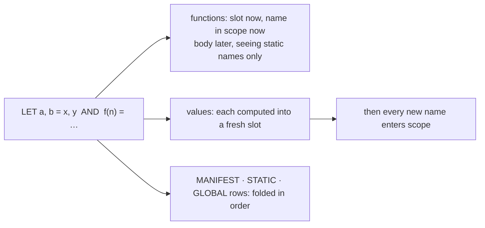
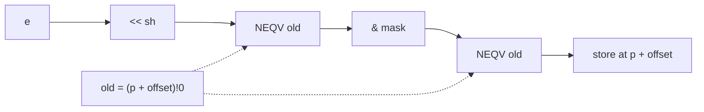

# trn

## Files

```mermaid
graph TD
    mod["trn/mod.rs<br/>Binding · Trn · Switch · translate<br/>emit · here · patch · lookup"]
    routine["routine.rs<br/>top · routine · enter · rows · slot · cell · global"]
    order["order.rs<br/>command"]
    express["express.rs<br/>expression · address · monad · dyad"]
    declare["declare.rs<br/>declare: a LET run"]
    loops["loops.rs<br/>headed · tailed · counted"]
    switch["switch.rs<br/>switch"]
    field["field.rs<br/>selector · field · store_field"]
    fold["fold.rs<br/>fold = evalconst"]
    labels["labels.rs<br/>command_labels · expression_labels"]
    mod --> routine --> order & express
    routine --> labels
    order --> declare & loops & switch & field & express
    express --> field & fold
    declare --> fold
```

## Two passes

```mermaid
sequenceDiagram
    participant T as translate
    participant P1 as pass 1, in written order
    participant P2 as pass 2
    participant R as routine
    T->>T: natives in slots 0..42, result2 in 43
    T->>P1: every declaration
    P1->>P1: a function gets a global slot
    P1->>P1: MANIFEST, constant LET folded into constants
    P1->>P1: GLOBAL to slot 44 + k, STATIC to a fresh slot with its value
    T->>P2: every function and routine
    P2->>R: routine(slot, base, body)
    R->>R: labels scanned, frame from slot 2, body laid down
    R->>R: GOTOs and label values patched
    R->>P2: then each function its blocks declared, with their static names
```

## A name — innermost first

```mermaid
flowchart LR
    N["name"] --> S{"scope, innermost last"}
    S -->|"Local(slot)"| LP["Lp slot"]
    S -->|"Const(k)"| NUM["Num k"]
    S -->|"Cell(slot)"| LG["Lg slot"]
    S -->|"not there"| K{"top-level constant"}
    K -->|"yes"| NUM
    K -->|"no"| G{"global vector"}
    G -->|"yes"| LG
    G -->|"no"| LB{"a label of this routine"}
    LB -->|"yes"| ADDR["Num its address, patched at the end"]
    LB -->|"no"| ERR["unknown name"]
```

## SWITCHON

```mermaid
flowchart TD
    E["e → hidden slot v"] --> J["Jump dispatch"]
    J -.-> BODY["the body: CASE k marks pc · DEFAULT marks pc · ENDCASE jumps to end"]
    BODY --> OFF["Jump end"]
    DIS["dispatch: for each CASE · Lp v · Num k · Eq · Jt case"] --> NONE["Jump DEFAULT, or end"]
    OFF --> END["end"]
    NONE --> END
```

## A LET run — declared together

```mermaid
flowchart LR
    R["LET a, b = x, y  AND  f(n) = …"] --> F["functions: slot now, name in scope now<br/>body later, seeing static names only"]
    R --> V["values: each computed into a fresh slot"]
    V --> B["then every new name enters scope"]
    R --> C["MANIFEST · STATIC · GLOBAL rows: folded in order"]
```

## f OF p := e — the field laid into the old word

```mermaid
flowchart LR
    Y["e"] --> SH["#lt;#lt; sh"] --> X1["NEQV old"] --> M["& mask"] --> X2["NEQV old"] --> ST["store at p + offset"]
    OLD["old = (p + offset)!0"] -.-> X1 & X2
```
