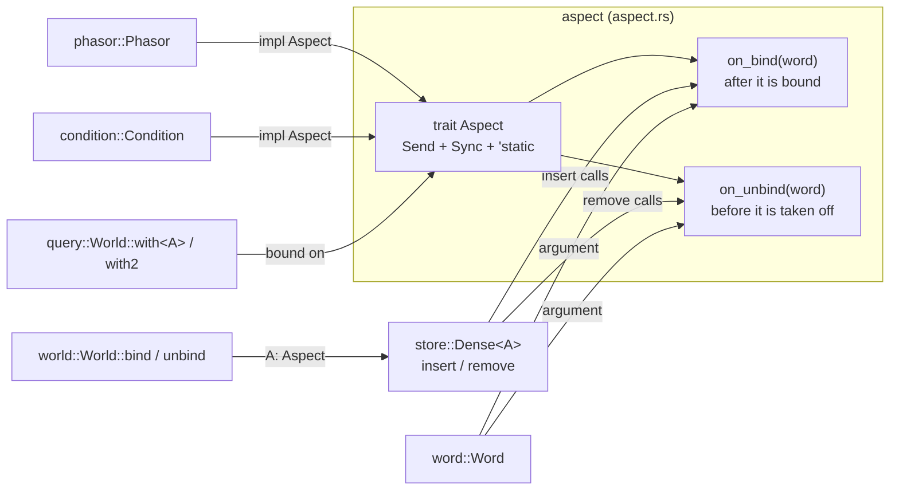

# aspect

```mermaid
graph LR
    subgraph aspectMod["aspect (aspect.rs)"]
        AspectTrait["trait Aspect<br/>Send + Sync + 'static"]
        onBind["on_bind(word)<br/>after it is bound"]
        onUnbind["on_unbind(word)<br/>before it is taken off"]
    end
    PhasorT["phasor::Phasor"]
    ConditionT["condition::Condition"]
    WorldBind["world::World::bind / unbind"]
    DenseStore["store::Dense&lt;A&gt;<br/>insert / remove"]
    QueryWith["query::World::with&lt;A&gt; / with2"]
    WordId["word::Word"]

    PhasorT -->|"impl Aspect"| AspectTrait
    ConditionT -->|"impl Aspect"| AspectTrait
    AspectTrait --> onBind
    AspectTrait --> onUnbind
    WorldBind -->|"A: Aspect"| DenseStore
    DenseStore -->|"insert calls"| onBind
    DenseStore -->|"remove calls"| onUnbind
    WordId -->|"argument"| onBind
    WordId -->|"argument"| onUnbind
    QueryWith -->|"bound on"| AspectTrait
```
